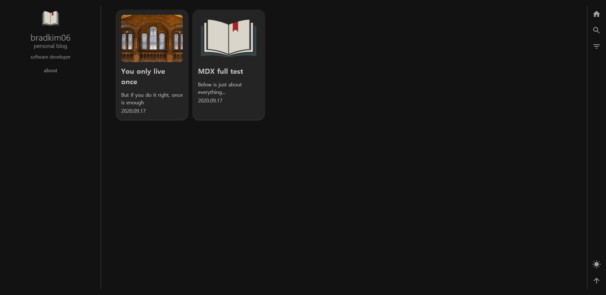

# bradkim06's Gatsby Blog

## Introduce

This blog is not my pure creation, but was created with reference to <a href="https://github.com/greglobinski/gatsby-starter-personal-blog"> greg lobinski's starter</a>. I like this starter so I wanted to use original, but it only work on Gatsby v1. So I port this starter to gatsby v2 with some changes. Thank greg lobinski for providing a beautiful design starter as open source.

## The difference between Original and Custom

|                         | Original  |      Custom      |
| :---------------------: | :-------: | :--------------: |
|   **Gatsby Version**    |    V1     |        V2        |
|      **Markdown**       |    .md    |    .md & .mdx    |
|        **style**        | react-jss | styled component |
| **component file type** |    js     |    TypeScript    |
|     **SearchTool**      |  Algoria  |     fuse.js      |
|  **FullScreen Button**  |     O     |        X         |
|    **Theme Toggle**     |     X     |        O         |

## Quick Start

Use the Gatsby CLI to create a new site.

### Prerequisites

yarn

```bash
# npm
npm install --global gatsby-cli
# yarn
yarn global add gatsby-cli
```

### Install & Run

```bash
# Install Starter
gatsby new [NEW_SITE_DIRECTORY_NAME] https://github.com/bradkim06/clone_greg_blog

# Go into the newly created directory and run
cd [NEW_SITE_DIRECTORY_NAME]
# http://localhost:8000
gatsby develop
```

You can write post both _.md, _.mdx

```bash
[NEW_SITE_DIRECTORY_NAME]/content/posts/[postName].md
# or
[NEW_SITE_DIRECTORY_NAME]/content/posts/[postName].mdx
```

## Demo

### Original


[Original Demo Site](https://gatsby-starter-personal-blog.greglobinski.com/).

### Custom



[Custom Demo Site](https://bradkim06.github.io/)
