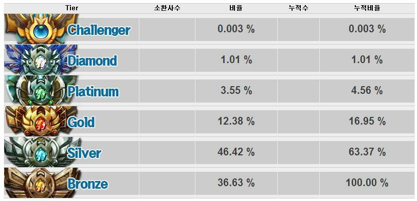

# 서론

나는 소프트웨어 마에스트로 연수 과정이 2013년쯤 종료되고 지금은 국민적 게임이 된 League of Legends(이하 LOL)를 친구의 추천으로 시작했었고 빠르게
매료되었다. LOL은 무작위로 매칭된 10명의 인원이 5:5의 팀 형식으로 승패를
가르는 AOS(Aeon Of Strife) 장르의 게임이었다.

> AOS란 플레이어가 하나의 캐릭터를 선택하고 그 캐릭터를 강화시켜 상대방 진영을
> 파괴하는게 목적인 게임 장르

<!-- 20대의 시절의 나는 낯을 가리는 편이며, 조별과제와 같은 팀플레이를 그리 좋아하지 않았는데 아이러니하게도 무작위로 매칭되는 팀게임은 꽤나 잘하는 편이었다. -->

나는 2013~2014년을 LOL의 랭크 게임, 즉 내가 이기고 지는 결과에 따라 순위가
변동되는 게임에 아주 몰입했었고 순위를 더 올리고 싶어했다. 랭크 게임은 매해
초기화 되며 1년 단위로 Season이 새로 시작하는데 나는 Season3, 4를 했었다. 첫해인
Season3는 다이아몬드 2티어로, Season4는 Master티어로 종료되었다. 당시 등급에 따른
분포비율은 아래 첨부 그림과 같았다. Season4에 새로 생긴 Master티어는 대략
랭킹 1000등 안이었던걸로 기억한다.

랭킹이 상위권으로 진입하면 Client에 내가 진행하는 경기가 모든 사람에게
공개되는데 이로 인해 모르는 사람에게 친추 요청이 많이 왔었고 나는 모두
받아줬었다. 무작위의 사람들이 친구 추가를 해서 말하는것은 크게 4개였다.

1. 자신의 아이디의 랭크를 올려주면 돈을 주겠다는 대가성 요청
2. 낮은 아이디를 가지고 있거나, 아이디를 빌려줄테니 자신과 듀오를 해달라는 요청
3. LOL 잘하는 법을 알려달라는 요청
4. 내 게임을 관전하고 싶어 친구 추가를 하는 요청

나는 3번 유형에 친구에 관심이 갔었다. 당시에 3번의 요청을 받고 호기심과 의문이 생겼다. LOL 랭크게임은 무작위(Random)의 매칭을 매 경기 하게 되고 5:5의 팀게임인데 나와 저 사람의 순위
차이는 정말로 실력의 차이일까? 나는 아주 운이 좋아 주사위를 굴렸는데 100번
연속 6이 나온 사람은 아닐까? 아니라면 어떻게 증명이 가능한가? LOL을 잘하는
것과 못하는 것의 차이는 무엇인가? 나는 LOL이라는 게임의 즐거움을 플레이에서
이론적 분석으로 시선을 돌렸다.

<!-- 당시 -->
<!-- 100명가량으로 프로게이머 수준으로 평가받는 최고 티어로 비록 프로게이머에는 -->
<!-- 욕심이 없었지만 나는 최고 등급을 달성하고 싶었다. 당시 다이아1~마스터티어쯤 되면 -->
<!-- 랭크게임에서 프로게이머와 종종 매칭이 되는데 그때 유명한 게이머들과 많이 매칭이 -->
<!-- 됐었다. -->

# 본론

## 내 랭크업의 비결은 모방

나는 1년 반의 게임 플레이 기간동안 실제 게임 시간은 하루에 1~3시간 가량으로
그것도 매일하지 않았다. 나는 잘하는 사람의 방송을 시청하는 것을 더 즐겼고
이 사람은 왜 이렇게 하는지 호기심을 가졌고 실제 플레이 2~3시간에서 그것을 모방하며 이해하는
과정을 반복했다.
