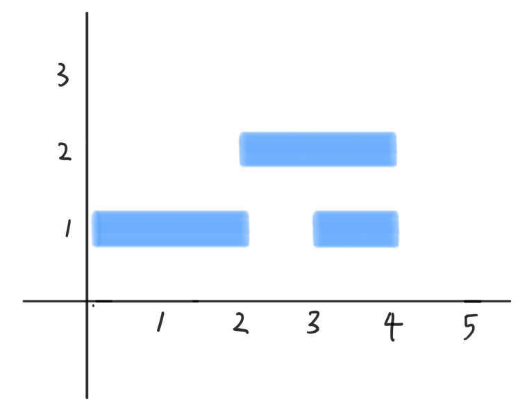

# 문제

온라인 달력 애플리케이션을 설계하는 문제를 생각해 보자. 설계할 구성요소 중 하나는 달력을 렌더링해서 시각적으로 표시하는 것이다.

매일 여러 개의 이벤트가 있고 각 이벤트는 시작 시간과 끝나는 시간이 있다고 가정하자. 이벤트는 닫힌 구간으로 표시되는 시작 시간과 종료 시간이 있다. 각 이벤트는 서로 겹치지 않는 직사각형 모양이며 X축과 Y축에 평행하다. X축을 시간이라고 하자.
이벤트의 시작시간이 b이고 끝나는 시간이 e라면, 직사각형의 양쪽 모서리는 b와 e에 있어야 한다.

이벤트의 Y축은 반드시 0과 L(미리 정의된 상수값) 사이에 있어야 하고, 각 이벤트의 직사각형의 '높이'(X축에 평행한 변과 변 사이의 길이)는 같아야 한다. 이제 각 이벤트 직사각형의 최대 높이를 계산해야 한다. 즉, 다음과 같은 문제를 살펴보자.

이벤트 집합이 주어졌을 때, 동시에 발생할 수 있는 이벤트의 최대 개수를 구하는 프로그램을 작성하라.

예를 들어 {{3, 4}, {0, 2}, {2, 4}}의 입력이 주어지면 Figure 1과 같이 되며 동시 발생하는 최대 개수는 2이다.

#### Figure 1



# 해답

start, end의 끝점을 정렬하여 end가 나오기 전에 발생하는 start는 겹치게 되므로 동시 발생 count로 계산한다.

$O(nlogn)$

```cpp
int FindMaxSimultaneousEvents(const vector<Event>& A) {
    struct Endpoint {
        int time;
        bool is_start;
    };

    // Builds an array of all endpoints.
    vector<Endpoint> E;
    for (const Event& event : A) {
        E.push_back({event.start, true});
        E.push_back({event.finish, false});
    }
    // Sorts the endpoint array according to the time, breaking ties
    // by putting start times before end times.
    sort(begin(E), end(E), [](const Endpoint& a, const Endpoint& b) {
        // If times are equal, an endpoint that starts an interval comes first.
        return a.time != b.time ? a.time < b.time : (a.is_start && !b.is_start);
    });

    // Track the number of simultaneous events, and record the maximum
    // number of simultaneous events.
    int max_num_simultaneous_events = 0, num_simultaneous_events = 0;
    for (const Endpoint& endpoint : E) {
        if (endpoint.is_start) {
            ++num_simultaneous_events;
            max_num_simultaneous_events =
                max(num_simultaneous_events, max_num_simultaneous_events);
        } else {
            --num_simultaneous_events;
        }
    }
    return max_num_simultaneous_events;
}
```
