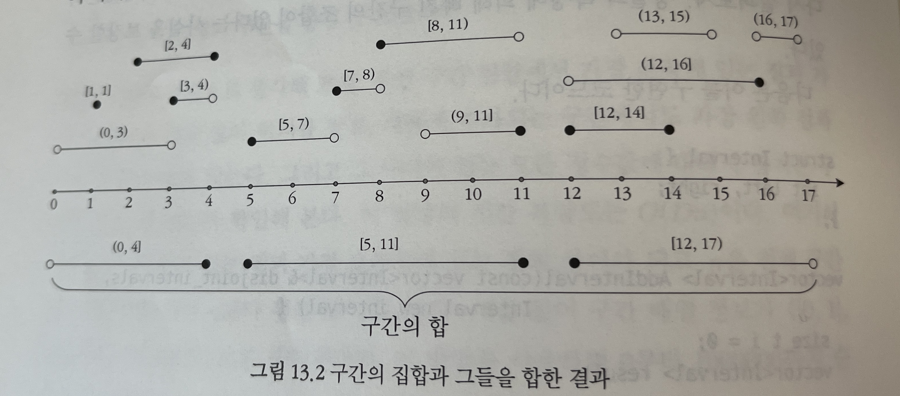

# 문제

끝점이 정수값으로 주어진 구간의 집합을 생각해 보자. 구간의 끝은 열린 구간일수도 있고 닫힌 구간일 수도 있다. 이런 구간의 집합을 하나로 합치려 한다.

구간의 집합이 입력으로 주어졌을 때, 이들을 합친 결과를 서로 중복되지 않는 구간 집합으로 출력하는 알고리즘을 설계하라.

#### Figure 1



# 해답

- Union Case
  - 가장 최근 입력된 구간의 right가 현재 left보다 크다면 Union을 한다.
  - Union은 현재 right가 크면 right를 갱신한다
  - 같다면 최근 입력된 left,right가 열린 구간일 경우 갱신한다.
- 이외의 Case는 겹치지 않으므로 그냥 저장하면 됨

```cpp
struct Interval {
    struct Endpoint {
        bool is_closed;
        int val;
    };

    Endpoint left, right;
};

vector<Interval> UnionOfIntervals(vector<Interval> intervals) {
    // Empty input.
    if (empty(intervals)) {
        return {};
    }

    // Sort intervals according to left endpoints of intervals.
    sort(begin(intervals), end(intervals),
         [](const Interval& a, const Interval& b) {
             if (a.left.val != b.left.val) {
                 return a.left.val < b.left.val;
             }
             // Left endpoints are equal, so now see if one is closed and the
             // other open - closed intervals should appear first.
             return a.left.is_closed && !b.left.is_closed;
         });
    vector<Interval> result;
    for (Interval i : intervals) {
        if (!empty(result) &&
            (i.left.val < result.back().right.val ||
             (i.left.val == result.back().right.val &&
              (i.left.is_closed || result.back().right.is_closed)))) {
            if (i.right.val > result.back().right.val ||
                (!result.back().right.is_closed &&
                 i.right.val == result.back().right.val)) {
                result.back().right = i.right;
            }
        } else {
            result.emplace_back(i);
        }
    }
    return result;
}
```
