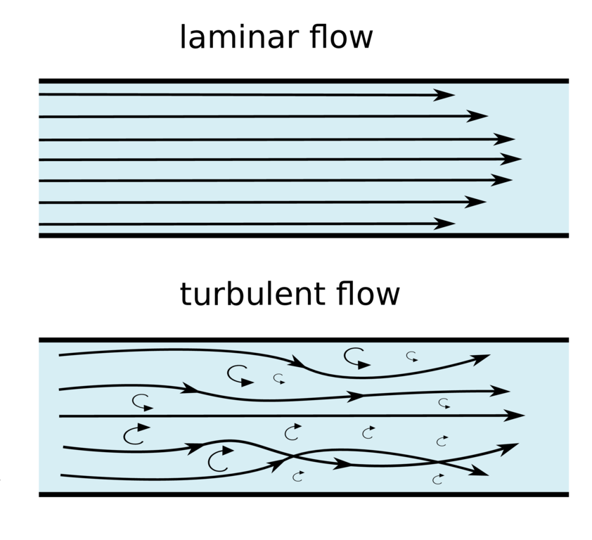
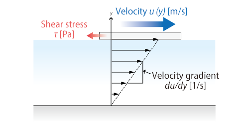
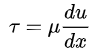
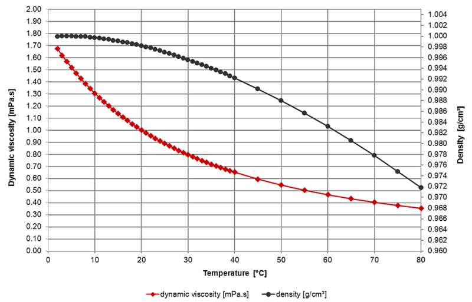
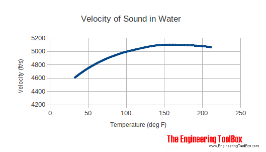

# Introduce

## Texas Instrument Ultrasonic sensing technology for flow metering


##### <center>Figure [Ultrasonic Flow Meter Principle]</center>

Ultrasonic sensing uses the time of flight (TOF) of an ultrasonic wave and its dependency on the flow rate of the medium to measure and calculate volume flow, using the difference in the propagation time of the ultrasonic wave when transmitted into and against the direction of the flow. TOF-based ultrasonic meters measure flow rates based on the difference in propagation time of ultrasonic signals in the upstream and downstream directions. The ultrasound wave travels faster when traveling in the direction of the flow and slower when against the flow.

The TOF measurement method has been changed from TDC -> ADC method, and the advantages of it are described in below document.

See more [Ultrasonic sensing technology for flow metering]

## How to get the volume flow

> 💬 This document was written in early 2019, and there is no calibration function, so it was resolved by the method described below. Currently, TI Solution includes a calibration function.

The procedure that getting volume is to infer the flow-rate by measuring the velocity of the fluid. The velocity is dependent on the pressure-drop gradient across the pipe or conduit. Since the cross-sectional area is constant, the flow rate is proportional to the velocity, and We've already been get velocity with USS system at [Texas Instrument Ultrasonic sensing technology](#TI_USS). So We could get volume with below equation.


**Q** = liquid flow through the pipe,
**V** = average velocity of the flow,
**A** = cross-sectional area of the pipe,

However, flow-in-pipe in the real world, equation will have wrong result. The reason is as follows.

## Why is the flow rate inaccurate? 🤔



##### <center>Figure: A simple sketch of difference between laminar fluid flow and turbulent fluid flow in a pipe</center>

Laminar flow can be regarded as a series of liquid cylinders in the pipe, where the innermost parts flow the fastest, and the cylinder touching the pipe isn't moving at all.

In turbulent flow vortices, eddies and wakes make the flow unpredictable. Turbulent flow happens in general at high flow rates and with larger pipes.

When a fluid is flowing through a closed channel such as a pipe or between two flat plates, either of two types of flow (laminar flow or turbulent flow) may occur depending on the velocity, viscosity of the fluid and the size of the pipe (or on the Reynolds number). Laminar flow tends to occur at lower velocities and high viscosity.

[Texas Instrument Ultrasonic sensing technology](#TI_USS) is correct in frictionless flow. However, laminar & turbulent flows exist in the real pipe because of friction. It makes the equation assuming measured center flowrate is equal in every cross-sectional area wrong.

> 💬 Shear stress in a laminar flow depends almost only on viscosity **μ** and is independent of density **ρ**.  
> 💬 Shear stress in a turbulent flow is a function of density **ρ**.

## Newton Fluid

A Newtonian fluid is a fluid in which the viscous stresses arising from its flow, at every point, are linearly correlated to the local strain rate—the rate of change of its deformation over time.

### Newton’s Law of Viscosity

This general physical law is derived from empirical observations. Consider a flow in which fluid particles move in a particular direction maintaining straight, parallel lines. For considering Viscosity, Newton proposed some fundamental assumption. He proposed that,



##### <center>Figure: Newton Fluid</center>

Firstly "When a flow is adjacent to surface stick to it & have zero velocity relative to the boundary which is called No slip Condition.Other fluid particles attempting to slide over them are retarded because of an interaction between faster & slower moving fluid, a phenomenon that gives rise to shearing force."

Secondly "Shear stress on an interface tangent to the direction of flow is proportional to distance rate of change of Velocity."

Mathematically,



µ is called coefficient of Viscosity. It can be considered as Modulus of Rigidity of fluid. Water who obey Newton’s viscosity law is Newtonian Fluids.

See more [What is a Newtonian Fluid?]

### Viscosity

Viscosity is a quantitative measure of a fluid’s resistance to flow. It determines fluid strain rate generated by a given applied shear stress. Viscosity is caused by cohesive force between molecules of liquid.

For many fluids the tangential, or shearing, stress that causes flow is directly proportional to the rate of shear strain, or rate of deformation, that results. In other words, the shear stress divided by the rate of shear strain is constant for a given fluid at a fixed temperature. This constant is called the dynamic, or absolute, viscosity and often simply the viscosity.

See more [What is Viscosity?]

Water is incompressibility fluid and satisfy the newton fluid conditions.
So we know what factor is cause ideal average velocity is wrong `shear stress`
As I said before, shear stress is decided viscosity & flowspeed situation.
so if we know viscosity & flowspeed, we can get the only variable that affect flowrate. The meaning of flowspeed is similar to pressure

### How to get viscosity?

Water viscosity by temperature is already known by measured data.

Temperature is the only factor of viscosity of water because incompressible fluid.



### Get Temperature

USS Library provide TOF(Time of Flight). Literally TOF means ultrasound flight time.

- flight distance is constant.
- TOF is a varaible but be provided by USS Library[User can treat it like a constant]
- flight speed is a variable of temperature




USS Library results provide the center flow velocity[pressure]
Now we know 2 variables of shear stress.

## Conclusion

prerequisite condition for solution derive from talked earlier.

1. Water is Newton Fluid
2. Shear stress is the only variable in Newton Fluid [Other variables can be ignored because it has a very small impact]<br />

conclusion, error rate of flowrate will be constant in same shear stress.
it may be possible many solution, but we decide to use empirical method for reduce current consumption from msp430
The flowrate calibration procedure is as follows.

1. **USS Library measuring -> TOF, DTOF, Ideal Flowspeed & Flowrate**
2. **Get Temperature from TOF**
3. **Get current Shear Stress with Temp & Ideal Flowspeed**
4. **Get real flowrate of Q3,Q2,Q1 with the test-bench**
5. **Save the proportional of ideal flowrate to real flowrate**
6. **the rest estimate value with interpolation method**

see code for detailed content.

# Project Tree

```text
.
├── App
├── Include
├── IQMathLib
├── QMathLib
├── USS_Config
├── ussSWLib
├── SINGLE_TONE
├── docs
├── shell
├── README.md
└── main.c
```

##### Figure [Project Tree]

- **elaborate on Project Tree**

  | Folder Name | Description                                                 |
  | :---------- | :---------------------------------------------------------- |
  | App         | `H/W Manage`, `Solution Newton Fluid`, `FlowMeter function` |
  | Include     | `USS Library .h` `ccs basic .h`                             |
  | \*\*MathLib | `TI Math Library`                                           |
  | USS_Config  | `TI PreDefine Config`                                       |
  | ussSwLib    | `TI USS Modules`                                            |
  | SINGLE_TONE | `build result directory`                                    |
  | docs        | `Documents`                                                 |
  | shell       | `shell prompt`                                              |

# Reference Link

[MSP430FR604x] : MSP430FR604x Chip Main Page

[USS] : ultrasonic sensing solution (USS) Guide & Program

[Ultrasonic sensing technology for flow metering] : Texas Instrument USS Introduce PDF

[What is Viscosity?] : Wiki Viscosity

[What is a Newtonian Fluid?] : Wiki Newton Fluid

[msp430fr604x]: https://www.ti.com/product/MSP430FR6047?utm_source=google&utm_medium=cpc&utm_campaign=epd-null-null-gpn_en-cpc-pf-google-kr&utm_content=msp430fr6047&ds_k=%257b_dssearchterm%257d&DCM=yes&gclid=Cj0KCQjw6uT4BRD5ARIsADwJQ180DqQrflpWQEnsS-TxGKxk1vEGAOdqlsK32EyVbYXqWTT6iuOo6zYaAqtJEALw_wcB&gclsrc=aw.ds
[uss]: https://software-dl.ti.com/msp430/msp430_public_sw/mcu/msp430/USSSWLib/USSSWLibWater/latest/index_FDS.html
[ultrasonic sensing technology for flow metering]: https://www.ti.com/lit/wp/sway007/sway007.pdf?ts=1595568620604&ref_url=https%253A%252F%252Fwww.google.com%252F
[what is viscosity?]: https://www.wisegeek.com/what-is-viscosity.htm
[what is a newtonian fluid?]: https://www.wisegeek.com/what-is-a-newtonian-fluid.htm
