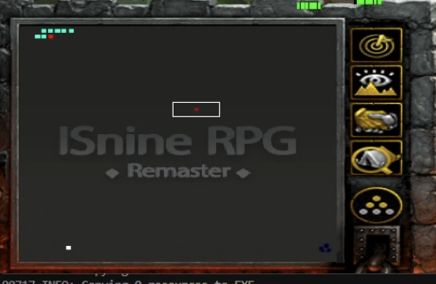

<!--toc:start-->
- [Numpad 7,8 아이템은 옵션상관없이 무조건 사용합니다. 원하지 않으면 아이템 순서를 재배치 하세요](#numpad-78-아이템은-옵션상관없이-무조건-사용합니다br원하지-않으면-아이템-순서를-재배치-하세요)
- [이즈나인 매크로 파일](#이즈나인-매크로-파일)
  - [TODO List](#todo-list)
  - [패치 내역](#패치-내역)
    - [1.35](#135)
    - [1.34](#134)
    - [1.32](#132)
    - [1.2](#12)
    - [1.1](#11)
  - [사족](#사족)
  - [주의할 점](#주의할-점)
  - [작동 예시](#작동-예시)
    - [기본 루틴](#기본-루틴)
    - [마우스 좌클릭 하는 스킬 사용 예](#마우스-좌클릭-하는-스킬-사용-예)
    - [키보드만 사용하는 스킬 사용 예](#키보드만-사용하는-스킬-사용-예)
  - [기본 기능 설명](#기본-기능-설명)
  - [X,Y 좌표를 설정하는 방법에 대한 이해](#xy-좌표를-설정하는-방법에-대한-이해)
    - [좌표 클릭 영상](#좌표-클릭-영상)
  - [사용 사례](#사용-사례)
    - [고정방끼리 계속 하고 싶어요](#고정방끼리-계속-하고-싶어요)
    - [솔로로 돌리고 싶진 않지만 고정방은 없어요](#솔로로-돌리고-싶진-않지만-고정방은-없어요)
    - [그냥 랜덤한 공방에 들어왔어요!](#그냥-랜덤한-공방에-들어왔어요)
    - [오픈채팅방에 좋은 공방이 생겼는데 원격이라 불편해요](#오픈채팅방에-좋은-공방이-생겼는데-원격이라-불편해요)
  - [GUI 기능별 설명서](#gui-기능별-설명서)
<!--toc:end-->

# Numpad 7,8 아이템은 옵션상관없이 무조건 사용합니다. 원하지 않으면 아이템 순서를 재배치 하세요

# 이즈나인 매크로 파일

<a href="/macro_1.35_dev.zip" download>macro_1.35_dev.zip</a>

## TODO List
- [ ] 좌표 프리셋 이름 수정 가능하게 변경
- [ ] 비공개 방생성 기능
- [ ] 죽음 발생시 사냥터 자동이동 기능 복구
- [ ] 행운의 주사위 발동후 끄기
- [ ] 마우스 좌클릭 스킬마다 설정가능하게
- [ ] 샌드박스 워크래프트는 간섭안하는 방법 찾기
- [ ] 방생성, 방참가시 중복 팝업 이미지 인식 처리 추가
- [ ] 페이탈 리방 기능 게임내 전체적으로 작동하게 개선

## 패치 내역

### 1.35

- [x] 의도치 않은 강제종료 Alt+q를 방지하기 위해 Alt키가 눌러지면
  스킬사용 안하게 변경.
- [x] 현재 리워크시 올바르지 않은 강종방식인것을 인지하여 정상종료로
  다시 변경. F10 -> E -> X -> X
- [x] 게임 초기 옵션 (메시지, 데미지 등) 한번만 입력으로 변경. `게임 시작전 한글채팅을 쳤다면 영어로 작동하므로 주의`
- [x] 방갈, 페이탈 리방 설정 저장 복구 추가
- [x] 방갈, 페이탈 리방 기능 확인완료

### 1.34
- [x]  몰이 기능, `패트롤과 함께사용 필수`
- [x]  이미지 서칭 정확도 개선
- [x]  방장 20초 늦게 재시작 -> 10초로 변경
- [x]  캐릭터 선택실패 Timeout 시간 변경 20 -> 10분
- [x]  페이탈 리방 : 다른사람 페이탈 감지시 리워크 추가, `인게임 초기설정,사냥터
  이동중에는 작동안함.`
- [x]  방갈 리방 : 게임 초반 캐릭터 선택화면에서 방 폭파되면 리워크 추가
- [x]  연결종료 발생시 리워크 코드 추가(검증 안됨)
- [x]  방생성 및 방참가 등 모든 매크로 수행 상태에서 주기적 리방 작동하게 개선(검증 안됨)
- [x] 몇가지 GUI설정 이름 변경

### 1.32

- [x] UI개선, 기능별 탭 분류
- [x] 해상도 1600x900 강제설정 여부 옵션추가
- [x] 죽음감지(마을 이미지 검색) 기능 삭제
- [x] 게임 시작시 로비인식 이미지 서칭 삭제
- [x] 방이름 "-+" 추가, 총 네개 시도 방제, 방제+, 방제-, 방제-+
- [x] 타임아웃 에러 개선, 아래 사항들 실패시 워크 종료후 처음부터 재시작
   - [x] 이미지 서칭 5분 실패시 kill
   - [x] 캐릭터 선택 20분 초과 kill
   - [x] 방생성 20분 초과 kill
   - [x] 방참가 모드시 방 입장후 게임시작 20분 초과 kill
   - [x] 캐릭터 화면진입 20분 초과 kill
- [x] 스킬 설정 추가 및 변경
   - [x] 이 기능들은 캐릭터가 화면 중앙에 위치하고, 체력바를 상시 표시로 해야 정상작동.
   - [x] 보스 발견 시: 보스가 pixel거리 150이내에 피가 70%이상인 경우 스킬사용
   - [x] 몬스터 발견 시:일반몬스터가 pixel거리 150이내에 풀피인경우 스킬사용
   - [x] 보스모드 -> 보스 끌어오기 pixel 150~500 범위의 자연 어그로 안되는 풀피 보스를 내자리로
     끌고옴.
   - [x] 이 기능들을 끄고 스킬사용을 하면 무한 사용시도
   - [x] numpad 7,8은 옵션을 설정안해도 사용
- [x] 간혹 "시야 -300"이 씹힐때가 있음, 시야 200에서도 정상작동하게 변경
- [x] 게임 초기 한영 상태를 알기 어려움, "-시야 300" 등 옵션을 한글,영문 둘다 시도함
- [x] 고정방 멤버들 방참가, 방생성 사용시 방장이 5분이상의 대기시간을 사용하면
  방참가 루틴 오류 발생 개선. 
-> 20분 까지 대기, 20분 이상 초과시 일시정지 기능 사용

### 1.2

- [x] 해상도 강제변경 제거, 수동으로 1600 900 설정 필수
- [x] 초기설정 메세지 -> 메시지로 수정
- [x] 방참가 인원은 메시지, 데미지 명령 안함, 방장만
- [x] 방참가 기능 재시도시 방제목 수정 안하는 오류 수정
- [x] 재시작 기능시 방장은 다른 멤버보다 20초 늦게 리워크
- [x] 마을에 동시 스폰시 좌표가 틀어지는 문제 수정
- [x] 매크로 정지, 리워크시 반응성 향상
- [x] 죽음 검색 이미지 대체
- [x] 워크 종료시 프로세스 강제종료대신 정상 종료방법으로 변경
- [x] 창고 번호지정 삭제
- [x] 버서커, 방랑자같은 특수 스킬, 게임내에서 한번만 사용하는 스킬용으로 "스킬
  한번만" 기능 추가. 방에 입장하여 사냥지역 이동후 한번만 사용함. 원하는 키들을
  한개 또는 여러개 입력하면 작동. 원하지 않을시 공백이나 스킬사용 비활성화

### 1.1

- [x] 해상도 변경 1920x1080 -> 1600x900

## 사족

실력이 미천하여 GUI는 지저분하고 설정방법들이 복잡합니다. 그래도 없는것 보다는
사용하시는게 좋을거라 생각하여 공유합니다.

매크로를 배포하는것은 처음이라 잘 작동할지, 작동한다면 유저들이 만족스러워 할지
모르겠습니다. 많이 부족하지만 문제없이 잘 사용하셨으면 좋겠네요.

## 주의할 점

- **macro.exe 파일을 `관리자 권한`으로 실행하세요.**
- 매크로는 워크래프트를 윈도우 `창모드`로 실행합니다.
- **워크래프트의 해상도는 `1600 x 900`만 지원합니다. 프로그램이 강제로
  설정합니다. 변경시 작동안함.**
- 방생성시 맵은 자동으로 이즈나인 맵 최신버전이 선택되어있다고 가정합니다.
- M16 로그인시 패스워드만 치면 되는 환경으로 가정합니다.
- `한글 입력을 제외한` 키보드 입력은 비활성으로 작동됩니다.
- `마우스 동작은 모두 활성상태에서만 작동`므로 강제로 윈도우 창을 활성화 시키며 마우스의 움직임도 강제됩니다.
- 설정된 값들은 매크로를 중지, 재시작 하거나 리워크 버튼을 누를때 새로
  읽어들입니다. `실행된채 설정만 바꾸는것은 작동되지 않습니다`
- 워크래프트 JNILoader 실행 -> M16 서버 로그인 -> 방생성 및 참가 -> 이즈나인 캐릭터 선택 ->
초기 설정(시야,메시지,이펙트 등) -> 사냥터 이동 -> 설정까지의 루틴은 매크로
정지후 재시작시 현재시점을 판단하지 못합니다. 저 과정에서 매크로를 중지시킨 경우
그냥 리워크 버튼으로 하거나 수동으로 해주세요
- 인게임 사냥터로 자리 잡은경우 매크로 중지/종료/재실행 버튼을 눌러도 잘
  작동할겁니다. 아마도...

## 작동 예시

### 기본 루틴
JNILoader 실행 -> M16 서버 로그인 -> 방생성 및 참가 -> 이즈나인 캐릭터 선택 ->
초기 설정(시야,메시지,이펙트 등) -> 사냥터 이동

<video width="600" controls>
  <source src="/매크로_기본루틴.mp4" type="video/mp4" />
  브라우저가 동영상을 지원하지 않습니다.
</video>

### 마우스 좌클릭 하는 스킬 사용 예
제자리 마우스 클릭을 계속 하므로 비활성 불가능. 매크로 사용시 다른작업 불가능
<video width="600" controls>
  <source src="/매크로_마우스_스킬사용.mp4" type="video/mp4" />
  브라우저가 동영상을 지원하지 않습니다.
</video>

### 키보드만 사용하는 스킬 사용 예
비활성 동작으로 다른 작업을 해도 문제없음. `화면을 가려도 동작하나 페이탈,죽음
발생시 화면을 강제로 앞으로 가져와서 마우스 클릭을 할수있음`
<video width="600" controls>
  <source src="/매크로_키보드_스킬사용.mp4" type="video/mp4" />
  브라우저가 동영상을 지원하지 않습니다.
</video>

## 기본 기능 설명

워크래프트 JNILoader 실행 -> M16 서버 로그인 -> 방생성 및 참가 -> 이즈나인 캐릭터 선택 ->
초기 설정(시야,메시지,이펙트 등) -> 사냥터 이동 -> 설정에 따른 (제자리 사냥 or 스킬사냥) 루틴이 반복됩니다.   사냥터 이동이 끝나면 죽음 감지 및 사냥터 재이동, 페이탈 감지, 재시작 루틴 등의 설정값을 기반으로 워크래프트를 종료 및 재시작 합니다. 매크로 실행시 사람의 개입없이
24시간 365일 돌아가는것을 목표로 만들어졌습니다... 만 버그가 발생할수 있습니다.

- 파일 구성
    - macro.exe : 매크로 실행파일입니다. `관리자 권한`으로 실행하세요.
    - img폴더 : 이미지 감지시 사용되는 파일들입니다.
    - config.json : 프로그램 설정을 저장하는 파일입니다. 매크로 재실행시 설정을
      복구 하기위해 사용됩니다. 자동으로 생성 및 변경됩니다.
    - rezised_printWindow.png : 디스코드 이미지 전송시 지속적으로 생성 됩니다.

## X,Y 좌표를 설정하는 방법에 대한 이해

매크로 화면을 보시면 X,Y 좌표를 입력하는 칸들이 있습니다.

이 X,Y 좌표를 설정하는 방법은 프로그램의 `좌표 얻기` 체크박스를 클릭한 뒤 마우스 우클릭을 해보시면
프로그램에 좌표값이 아래 내용과 같이 출력됩니다.

`[04/04 09:50] [윈도우=Warcraft III] (913,415)`

여기서 913를 X좌표, 415를 Y좌표로 설정하시면 됩니다.

모든 좌표값은 `워크래프트 미니맵을 클릭`하므로 좌표 얻기 기능으로 미니맵상에 원하는 좌표를
찾아낸 뒤 입력하시기 바랍니다

### 좌표 클릭 영상

<video width="600" controls>
  <source src="/좌표출력_예시.mp4" type="video/mp4" />
  브라우저가 동영상을 지원하지 않습니다.
</video>

## 사용 사례

제가 생각하는 사용 케이스입니다.

### 고정방끼리 계속 하고 싶어요

- 매크로의 재시작 기능을 활성화 하고 재시작 주기(예: 4시간)으로 설정합니다.
- 방능이 가능한 한명은 방생성 모드, 나머지는 방참가 모드로 설정하고 시작대기(5분)설정합니다.
- 이러면 0,4,8,12,16,20,24 시 마다 모든 멤버들이 방 생성 및 참가를 시도합니다.

> 만약 페이탈이 난 멤버라면 워크를 재실행하고 5분간 방참가 실패를 하고 솔로방을
만들어서 진행하다가 다시 정해진 시간에 방 생성 및 참가를 시도해서 만나게 됩니다.

> 본인 외에 페이탈 감지 방법을 아직 고민중이라 고정방 기능 대체용입니다. 좋은
> 방법이 생각나거나 시간 남으면 개선해볼게요

### 솔로로 돌리고 싶진 않지만 고정방은 없어요

- 매크로의 재시작 기능을 활성화 하고 재시작 주기(예: 4시간)으로 설정합니다.
- 오픈 채팅방에 4시간마다(0,4,8,12,16,20,24 시)에 왈라34 "9900++" 생성후 5분뒤 출발. 올려놓으면 오지 않을까요...?

### 그냥 랜덤한 공방에 들어왔어요!

- 수동으로 방참가 및 자리 잡으시고 매크로 다시 켜시면 페이탈 발생하면 매크로
  루틴대로 또 돌아갑니다.

### 오픈채팅방에 좋은 공방이 생겼는데 원격이라 불편해요

- 매크로 중지 -> 방이름 설정 -> 방참가 활성화 -> 사냥지역 프리셋 선택 -> 리워크 하면 자동 참가 됩니다.

## GUI 기능별 설명서

- **JNI 경로** : JNILoader.exe 파일의 경로를 입력하세요.
    - **찾아보기** : 파일의 경로를 찾는 탐색기가 열립니다. JNILoader.exe파일을 찾아
      열기 혹은 더블클릭을 해주세요.
- **비밀번호** : M16 서버의 로그인 패스워드를 입력해주세요.
`ID는 이미 입력이 되어있다고 가정합니다`
- **방이름** : 이즈나인 방생성,참가시 사용할 이름입니다. 영어,특수문자,숫자 가능합니다. `한글 불가능`
- **캐릭터** : 사용할 캐릭터를 선택해 주세요.
- **프리셋 및 좌표 설정**
    - **프리셋** : 임의의 좌표 설정을 읽어오거나 저장할수 있습니다.
        - **저장하기** : 현재 설정된 좌표설정, 패트롤 설정 저장합니다.
    - **지역** : 포탈에서 지역으로 이동하는 단축키를 입력하세요. 예)
      사막=q,왈라=e,유적=r
    - **X좌표, Y좌표** : 사냥할 지역의 미니맵 클릭 좌표를 X,Y 좌표로 입력하세요
- **패트롤** : 워크래프트 패트롤 기능(p)를 이용합니다. 최대 2개의 좌표값을 넣을수
  있으며 기존 X좌표, Y좌표까지 3개지점을 패트롤 합니다. `이 기능은 초기 사냥터 이동시 단
  한번만 패트롤 클릭을 합니다`
    - **패트롤 좌표 1,2** : 패트롤 기능을 활성화 하면 패트롤 좌표 박스가 생성됩니다.
      패트롤은 X,Y -> 패트롤X,Y -> 패트롤 X2,Y2 순으로 삼각패트롤로 지정됩니다. `패트롤
      X2,Y2의 경우는 0,0으로 채워넣으시면 직선 패트롤 X,Y -> 패트롤 X,Y로
      작동합니다`
- **방 모드** : 방을 생성할지, 참가할지를 설정합니다.
    - **방생성** : 이즈나인 방을 설정한 "방이름"으로 만듭니다. 방 제목이 중복되면 방제목 끝에 "+", "-"를 붙여서 다시 시도합니다. 예) 1234로 방생성 중복시 1234+로 재시도, 또 중복시 1234-로 재시도 1234->1234+->1234- 3개의 이름으로 무한 재시도 
    - **방참가** : 이즈나인 방참가를 시도합니다. 마찬가지로 실패시 "+", "-"를
      붙여서 재시도합니다.
    - **시작 대기(분)** : 방생성, 방참가에 따라 동작이 다릅니다. 5분으로 설정할
      경우 아래와 같이 동작합니다.
        - 방생성시 방을 생성하고 5분만큼 대기한 뒤 게임을
          시작합니다. 
          `만약 수동으로 시작한다면 시작대기 시간을 무시하고 바로 진행합니다.`
        - 방참가시 방참가를 5분동안 계속 시도합니다. `5분 초과시 방참가를
          포기하고 랜덤한 방이름으로 방생성을 하여 진행합니다.`
- **디스코드 전송 설정** : 게임 전송주기에 따라 게임 화면, 에러,
  캐릭터 죽음 발생시 설정된 디스코드로 전송합니다. `디스코드 웹훅`이라고
  검색하면 생성방법들이 많습니다. 따라해보세요.
    - **Token** : 웹훅 생성시 나오는 URL(https://discord.com/api/webhooks로 시작하는 문자열) 전체를 넣으시면 됩니다. 아무것도 입력하지 않으면 디스코드 전송이 작동 하지 않습니다.
    - **이미지 전송**, **전송 주기(분)** : 전송 주기에 따라 워크래프트 화면을
      캡처하여 전송합니다.
    - **에러** : 매크로 에러 발생 메시지를 전송합니다. `보통 페이탈 상황, 윈도우
      활성화 실패등의 에러가 발생합니다.` 에러메시지 폭탄을 받는 상황이 가끔
      발생할 수 있으므로 페이탈 시점을 알고싶은게 아니라면 끄셔도 됩니다.
    - **죽음** : 캐릭터가 죽었음을 감지하면 전송합니다. 사냥터 복귀는 자동으로
      됩니다.
- **보스 모드** : 내 화면 주변 200~600pixel 범위내에 보스의 체력바가 90% 이상인 이미지를 찾으면 내 지정좌표로 끌어옵니다. 이 모드를 사용시 게임화면이 강제로 나를 중심으로 잡게됩니다.
- **어둠 세팅** : 포스 -2렙 사냥터를 위한 설정입니다. numpad_4자리에 하급
  보석(사용시 -25% 체력감소)를 넣어두시면 초기 사냥터 이동시 3번을 사용하여
  체력이 25%가 됩니다.
- **좌표 얻기** : 활성화시 마우스 우클릭을 하면 좌표가 출력됩니다.
- **opengl** : 워크래프트를 opengl모드로 실행합니다.
- **재시작 기능** : `0시를 기준으로 설정된 시간때마다 리워크`를
  실행합니다. 고정방 멤버를 위한 기능으로 만들었습니다.  예) 3시간 설정시 0,3,6,9,12,15,18,21시에 재실행
- **Global Delay Factor** : 전체 딜레이를 변경합니다. 높을수록 안정적이나
  느립니다. 1.0이하로 내리는것은 테스트가 되지 않아 불안정할수 있습니다.
  매크로가 정상적으로 작동하지 않는다면 딜레이를 올려보세요.
- **스킬 설정** : 스킬 사용 및 세부사항을 설정합니다.
    - **스킬 사용** : 활성화시 설정된 스킬들을 사용합니다.
    - **q,w,e,r,t,d,f 사용** : 사용하고 싶은 스킬을 활성화 합니다.
    - **마우스 클릭 스킬** : 마우스를 좌클릭해야 하는 스킬 사용시 활성화
      해주세요. 제자리 스킬(`X,Y좌표로 스킬을 사용`)로 작동합니다.
- **실행 종료(F5)** : 매크로를 실행하거나 중지합니다.
- **정지(F6)** : 매크로를 일시정지 / 재개 합니다.
- **리워크(F7)** : 게임 저장후 워크래프트를 강제 종료하고 리방을 합니다.

- **최하단 텍스트** : 매크로 최하단에 배경색과 글자가 표시됩니다. `매크로는 종료, 정지명령에 즉각적으로 반응하지 못합니다. 실제로 종료 및 정지 상태는 이 텍스트와 색깔로 구분해주세요`
