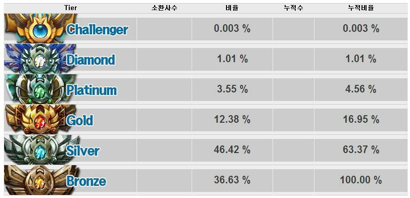

# 서론

나는 소프트웨어 마에스트로 연수 과정이 2013년쯤 종료되고 지금은 국민적 게임이 된 League of Legends(이하 LOL)를 친구의 추천으로 시작했었고 빠르게 매료되었다. LOL은 무작위로 매칭된 10명의 인원이 5:5의 팀 형식으로 승패를
가르는 AOS(Aeon Of Strife) 장르의 게임이었다.

> AOS란 플레이어가 하나의 캐릭터를 선택하고 그 캐릭터를 강화시켜 상대방 진영을
> 파괴하는게 목적인 게임 장르

나는 2013~2014년을 LOL의 랭크 게임, 즉 팀이 이기고 지는 결과에 따라 순위가
변동되는 게임에 몰입했었고 순위를 더 올리고 싶어했다. 랭크 게임은 여느 스포츠와 같이 매해
초기화 되며 1년 단위로 Season이 새로 시작하는데 나는 Season3, 4를 했었다.

> Season 1, 2는 미국서버만 가능했고 사실상 Season3가 한국 서버의
> 시작이었던걸로 기억한다.

첫해인 Season3는 다이아몬드 2티어로, Season4는 Master티어로 종료되었다. 당시 등급에 따른
분포비율은 아래 첨부 그림과 같았다. Season4에 새로 생긴 Master티어는
Diamond와 Challenger 사이로 대략 랭킹 1000등 안이었던걸로 기억한다.

랭킹이 상위권으로 진입하면서 내가 진행하는 경기가 실시간으로 Client의 모든 사람에게
공개되었는데 이로 인해 모르는 사람에게 친추 요청이 많이 왔었고 나는 모두
받아줬었다. 그 사람들이 친구 추가를 해서 말하는것은 크게 4개였다.

1. 자신의 아이디의 랭크를 올려주면 돈을 주겠다는 대가성 요청
2. 낮은 아이디를 가지고 있거나, 아이디를 빌려줄테니 자신과 듀오를 해달라는 요청
3. LOL 잘하는 법을 알려달라는 요청
4. 내 게임을 관전하고 싶어 친구 추가를 하는 요청

나는 3, 4번 유형에 친구에 관심이 갔고 호기심과 의문이 생겼다. 저 사람들의 말은 요약하자면 잘하고 싶었고 랭크를 올리고 싶은데 잘 안되고 방법을 모르겠다 였다. LOL 랭크게임은 시스템이 임의의 9명을 매칭을 매번 하게 되고 5:5의 팀게임인데 이렇게 강한 무작위성이 있는 게임에 나와 저 사람의 순위
차이는 정말로 실력의 차이일까? 실력의 차이라면 LOL을 잘하는 사람과 못하는 사람의 차이는 무엇인가? 어떻게 증명이 가능한가? 나는 LOL이라는 게임의 즐거움을 플레이에서 이론적 분석으로 관심이 가기 시작했다.

이 글은 내 랭크의 자랑도 아니고 LOL을 못하는 누군가에게 훈계를 하는것도 아니다. 상당수의 플레이어들은 잘하던 못하던 친구들과 함께 즐겁게 하고있으며 그게 게임의 본질이라 생각한다. 잘하는 플레이어란 무엇인가 정의를 내릴 분석에 흥미를 느낄 뿐이다.

# 본론

내가 느끼기에 게임 분석은 마치 포커, 증권이론과 유사했다. 불확실성으로
가득하고 너무나 많은 변수가 존재해 정량적인 과학적 방법론만으로 진행할 수 없고
정성적 분석이 필수적이다. 따라서 이 글은 LOL을 잘하게 하는 쉬운 공식은
제공하지 못한다. 다만 정성적 분석이라 해도 내가 생각할 때 일반화 할 수 없는것들은 배제하였고 최대한 많은
플레이어들에게 적용되는 부분만 작성했다.

<!-- 나는 개인적으로 자기계발 도서를 좋아하지 않는다. 일반적으로 통용되고 -->
<!-- 수학적으로 딱 떨어지는것들을 좋아하고 추상적이며, 뜬구름 잡는 듯한 글은 싫어하기 때문이다. 하지만 게임분석은 추상적 요소가 빠질수 없었고 글을 다 쓰고 내가 읽어보니 사이비과학같은 느낌도 든다. -->

## LOL은 운빨 게임인가?

나는 LOL에 운적 요소가 없다고 말할 수 없다. 랭크게임은 MMR(Matchmaking Rating)이라는
시스템으로 나와 최대한 비슷한 실력의 플레이어들을 9명을 찾아 매칭해주려 하지만
완벽하게 공평하지 않다.
극단적으로는 상대팀에 대리 게이머, 부캐가 있을수도 있으며 우리팀에는 소위
말하는 트롤, 어뷰저가 있을수도 있다. 이러한 근거로 일부 플레이어들은 내가 랭킹을 올리지 못하는것은 운이 너무
없어서이며 내가 상위 티어로 가도 잘할 수 있다고 한다. 하지만 이것은 틀렸다.

이러한 불운은 나에게만 적용되지 않으며 다른 플레이어도 동일하다. 또한 통계적 확률이 많아질수록 수학적 확률과 가까워져 가듯이 단판이 아닌
게임의 횟수가 많아지면 운적인 요소는 극히 작아지고 내 실력으로 승패가 판가름날
확률이 극히 높아진다.

이렇게 생각하는 근거는 앞서 말한 MMR 매칭이다. LOL은 MMR을 통해 최대한 비슷한 사람들끼리 매칭을 해주므로 운적인 요소를 최소화 시켜주고 만약 내가 해당 MMR보다 월등히 뛰어난 실력인 사람이라면 게임의 횟수가 많아질수록 승률은 50%보다 높을 수 밖에 없다. 따라서 내가 특정 MMR에서 게임의 횟수가 많았는데 점수는 그대로라면 거기가 내 임계점의 점수이며 실력이다. 만약 임계 MMR보다 높은곳에서 게임을 하면 승률이 50%이하로 떨어지며 임계점으로 되돌아 올것이다.

나는 이것을 스스로 증명하기 위해 3개의 부캐를 키웠으며 MMR이 낮은구간에서는
승률이 90%에서 내 임계점인 다이아1~마스터 구간부터 승률이 50%로 떨어지는것을
똑같이 반복했다. 나는 꽤 많은 LOL 플레이어를 봤는데 운이 없어서라는 말을 자주하는 플레이어가 점수를 올리는 경우는 보지 못했다.

### 이미 결정된 운적 요소는 낙장불입

랭크 게임을 시작했다고 가정해보자. 정말 운이 없게도 팀원중 한명이 나가서 들어오지 않거나, 혹은 내가
바텀라인에 갔는데 듀오의 플레이가 아주 형편없어 내가 정중히 조언을 해줘도
듣지 않아 상대팀에게 계속 킬을 줄 때 기타 등등으로 인해
발생하는 피해들을 다양하고 창의적으로 겪을수 있을것이다.

이런 게임은 보통 플레어이들끼리 싸움으로 번진다. 니가 잘했니 내가 잘했니로. 나는 딱 잘라 말하고 싶다. 누가 잘했고 못했고를 판결 받는것은 전혀 중요하지 않다. 오히려 게임의 승리, 내 성장에 방해가 된다. 이미 게임에 들어간 이상 내가 통제할 수 없는 부분들에 스트레스를 받거나 바꾸려고 하는것은 일종의 매몰비용 소모다. 그리고 경험상 임의로 매칭된 타인을 훈계하는 것은 올바른 말을 해도 부정적인 결과가 많았다.

심지어 이런 상황에 어쩔수 없잖아라고 자기합리화를 하고 게임을 포기하는것은 최악이다. 당신이 아는 LOL을 가장 잘한다고 생각하는 사람이 나 대신 지금 상황의 게임을 했을 때 질것 같은지 한번 생각해보라. 나는 이런 상황에 대부분 프로가 나대신 했다면 이겼을거라 생각했었고 외부 요인에 상관없이 나의 개선점에만 집중했다.

### 올라가고 싶은 플레이어에게 필수인 위닝 멘탈리티

앞에서 했던 말과는 다르게 고랭크로 갈수록 아이러니하게 성격이 좋지않은
다혈질적 플레이어들이 많다. 하지만 재미있던 것은 고랭크로 갈수록 싸워도 게임을
포기하지 않고 오히려 악착같이 이기려고 하는 사람이 많았다. 아무리 불리한
게임이라도 이길 방법을 모색하는 것이다. 나는 이 위닝 멘탈리티가 있는 사람과
없는 사람이 현재 비슷한 실력이더라도 시간이 지나면 차이가 벌어진다는데에
장담할 수 있다.

그 한판을 이기고 지는 측면에서 불리한 상황에서 최선을 다하라는 것이 아니다.
한번의 승패는 전혀 중요하지 않다. 나는 개인적으로 이런 불합리한
게임일수록 최선을 다했을때 LOL 실력이 더 좋아지는걸 느꼈다. 내가 기상학을
연구하는 학자라고 하자. 평소처럼 맑고 좋은날은 나의 연구에 도움이 되지 않는다.
만약 보기드문 태풍이 오는날이라면 이 사람은 평소보다 더 열심히 연구할것이
많아지고 발전할 것이다. LOL도 마찬가지라 생각한다. 오히려 많이 경험해왔던 일반적인 구도의
게임은 내 성장에 자극이 적고 불리한 상황은 내가 학습할 수 있는 새로운 상황이
많은 정보 엔트로피가 높은 상황이다.

당신은 LOL을 계속하는 한 승리와 패배가 적힌 동전을 수없이 던질것이고 조금이라도 승리가 더 나오게
할 방법들을 스스로 많이 알아내야 한다. 그 배움은 오히려 내가 상대방에게
변명의 여지없이 처참하게 질때, 팀이 어려운 상황일때 알 수 있다는것을 기억하고 최악의 상황에서도 다양한 시도를 해봐야 한다.

## LOL을 잘한다는것은 무엇인가?

요약해서 정의하자면 LOL의 실력은 곧 판단 능력이다. 플레이어가 현재 관찰 가능한 정보를 세심하고 빠른 분석으로 무엇을 해야하는가를 끊임없이 판단하는
과정이고 뛰어난 판단을 자주하는 사람이면 랭킹이 올라간다. 이것은 AOS장르 뿐만
아니라 FPS, 전략 시뮬레이션 게임등 대부분이 모두 동일하다고 생각한다.

그렇다면 판단능력을 올리기 위해 학습해야될 요소들은 무엇이며 이사람이 좋은
판단을 했는지 증명은 어떻게 해야할까?

플레이어가 이 게임내에서 가장 좋은 판단을 했는지 증명은 간단하다. 첫번째는
승리하는 것이며, 두번째는 게임
내에서 Level, CS 수급량이 가장 높은가로 판단할 수 있다. 이사람이 얼마나
효율적으로 게임을 했는지 나타내는 가장 정확한 지표이기 때문이다.

게임내에서 Level, CS가 가장 높다는 것을 의식하고 플레이를 해보기 바란다.
그것이 생각보다 쉽지 않다는걸 알게 될 것이다. CS는 쉼없이 밀려오며 상대방 플레이어들은 내가 CS를 편하게 먹도록 가만두지 않는다. 견제를 받아내며 수급해야 한다. 그리고 Level,CS가 높다는것은 그만큼 내가 적게 죽었다는 의미도 된다.

많은 사람들이 Kill을
기준으로 그사람의 실력을 판단하지만 정확한 기준이 못된다. 단순히 Kill이 많은것은
효율적 게임과는 무관할 수 있기 때문이다. Kill은 내가 Level과 CS를 올리는
과정에서 잘했을때 오는 보너스로 생각하라. 보너스를 많이 받지 못한다고 지지
않는다. 오히려 죽는것을 최소화 하는것이 게임을 이기는 지름길이다.

<!-- ## 내 랭크업의 비결은 모방 -->

<!-- LOL의 실력 상승은 메타인지 능력에서부터 시작한다. 내가 -->
<!-- 못한것을 복기하고 교정하는 사람이 판수가 많아질수록 더욱 높은 MMR로 간다. 하지만 LOL은 실시간으로 게임이 -->
<!-- 복잡하게 진행되며 내가 잘한건지 못한건지 정답을 알려주는 사람이 없다. -->
<!-- Replay기능을 지원하지만 Replay로 복기를 하더라도 스스로 명확하게 알기가 -->
<!-- 힘들다. -->

<!-- 그래서 나는 어떤식으로 랭킹을 올렸는지 생각해봤다. 내가 랭크업을 하는 방법 단순햇다. 나는 1년 반의 게임 플레이 기간동안 실제 게임 시간은 하루에 1~3시간 가량으로 -->
<!-- 그것도 매일하지 않았다. 나는 잘하는 사람의 방송을 시청하는 것을 더 즐겼다. -->
<!-- 방송을 보면서 나라면 이렇게 플레이 할거 같은데라는 생각을 먼저 하고 -->
<!-- 이사람이 어떻게 하는지 관찰했다. 이 사람이 플레이하는 방식은 적어도 나보다 정답에 가깝다는걸 인정하고 -->
<!-- 내 생각과 다른 플레이가 나오면 왜 잘하는 사람은 저렇게 하는지 내 나름의 해석을 했고 실제 플레이에서 그것이 맞는지, 나도 할 수 있는건지 확인하는 과정을 반복했었다. 시간이 지나자 나는 LOL에서 다룰수 있는 챔피언이 많아졌고 플레이 방법이 다양해졌고 판단이 정확해지기 시작했다. LOL을 시작한지 2~3달 사이에 방송을 보던 사람과 매칭되기 시작했다. -->

<!-- 내 생각엔 잘하는 사람의 방송을 시청하는 행위가 없었다면 게임을 12시간씩 매일해도 Diamond, -->
<!-- Master를 달성하는데 더 오랜 시간이 걸렸을 것이다. 나는 누구나 잘하는 사람의 플레이를 유심히 관찰하면서 -->
<!-- 고민하고 생각하기만 해도 Diamond까는 갈수 있다는걸 의심치 않으며 실제로 몇명의 -->
<!-- 사람은 일종의 멘토링으로 Diamond까지 스스로 갈수있는 실력을 만들어 주었다. -->

<!-- 단순 모방이 아닌 유심히 관찰하고 고민한다는것은 예를들면 다음과 같다. -->

<!-- - A플레이어는 Lucian이라는 챔피언을 미드로 쓸 때 어떨때는 -->
<!--   1레벨에 상대가 숨도 못쉴만큼 압박하고 어떨때는 견제를 하지 않고 라인을 -->
<!--   땡긴다 이유가 뭘까?   -->
<!--   - 견제를 하지 않을 때 나의 생각  -->
<!--     -> 상대 정글, 서폿과 우리 정글, 서폿의 조합에 따라 갱킹의 위협도가 -->
<!--     달라짐. 또한 라인을 민다고 해서 이득볼 수 있는게 없음  -->
<!--   - 견제를 강하게 할 때 나의 생각  -->
<!--     -> 아군 정글이 공격적인 동선을 보이거나, 탑 바텀의 로밍 각이 나온다면 상대 미드보다 빠른 지원을 위해 -->
<!--     갱킹의 위협이 있더라도 압박을 줌. -->

# 작성중...
