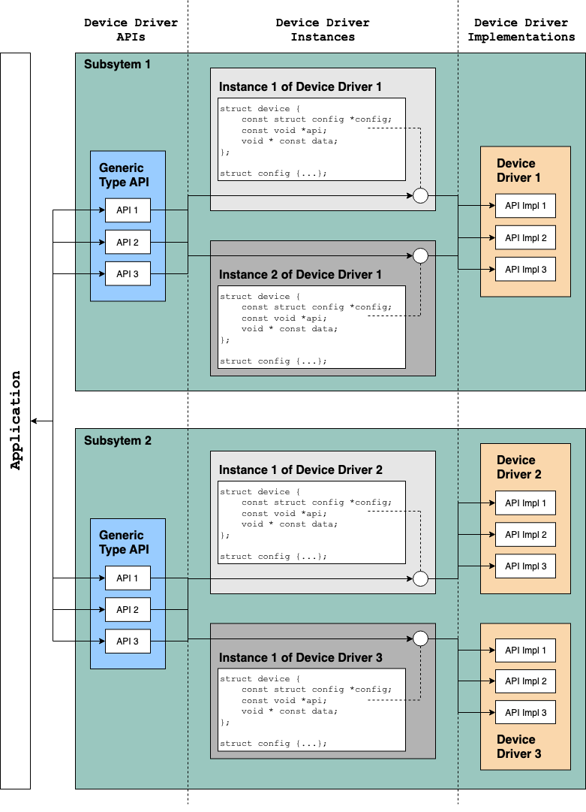
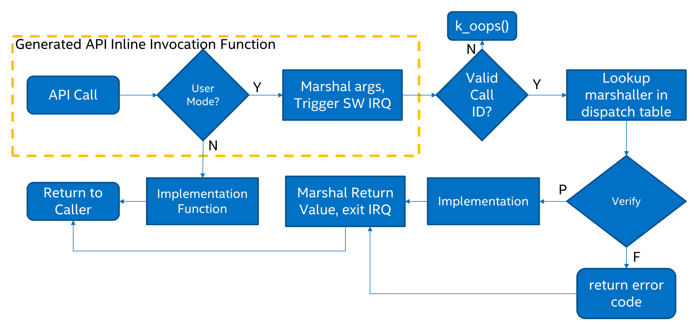

# Device Driver 분석

Devicetree에 대한 이해가 필요합니다. Devicetree 분석을 참조하세요

Devicetree는 User Application 영역에서 실제 하드웨어 구현 코드에 자유로우며 동일한 Application이 여러 하드웨어에 적용될 수 있습니다. 실제 구현코드를 Zephyr API구조에 맞춰주는 Device Driver가 필요하다. User는 이미 Device Driver가 존재한다면 구현에 신경쓰지 않고 Generic API만 잘 써도 대부분의 App개발이 가능하다.

하지만 개별 보드를 제작하고 센서를 사용할 경우 Device Driver를 작성해야할 필요가 있으므로 분석해본다. NCS(Nordic Connect SDK v2.4.2), Zephyr v3.3.99기준.

Zephyr 디바이스 드라이버의 흐름은 다음과 같다.



Figure1



## LED0 Device Node

마찬가지로 `sample/basic/blinky` 로 분석한다.

Devicetree에서 분석했듯이 `gpio_dt_spec` 구조체(led)가 선언되고 Zephyr API Macro로 정보를 모두 가져왔다.

```c lineNumbers=true {7,13}
// zephyr/include/zephyr/drivers/gpio.h

#include <zephyr/kernel.h>
#include <zephyr/drivers/gpio.h>

/* The devicetree node identifier for the "led0" alias. */
#define LED0_NODE DT_ALIAS(led0)

/*
 * A build error on this line means your board is unsupported.
 * See the sample documentation for information on how to fix this.
 */
static const struct gpio_dt_spec led = GPIO_DT_SPEC_GET(LED0_NODE, gpios);
```

`gpio_dt_spec` 구조체는 `struct device`를 포함하는데 Runtime에 사용될 api들이 함수 포인터로 연결되어 있을것이다.

```c lineNumbers=true {5,19}
struct gpio_dt_spec {
	/** GPIO device controlling the pin */
	const struct device *port;
	/** The pin's number on the device */
	gpio_pin_t pin;
	/** The pin's configuration flags as specified in devicetree */
	gpio_dt_flags_t dt_flags;
};

/**
 * @brief Runtime device structure (in ROM) per driver instance
 */
struct device {
	/** Name of the device instance */
	const char *name;
	/** Address of device instance config information */
	const void *config;
	/** Address of the API structure exposed by the device instance */
	const void *api;
	/** Address of the common device state */
	struct device_state *state;
	/** Address of the device instance private data */
	void *data;
	/**
	 * Optional pointer to handles associated with the device.
	 *
	 * This encodes a sequence of sets of device handles that have some
	 * relationship to this node. The individual sets are extracted with
	 * dedicated API, such as device_required_handles_get().
	 */
	Z_DEVICE_HANDLES_CONST device_handle_t *handles;

#if defined(CONFIG_PM_DEVICE) || defined(__DOXYGEN__)
	/**
	 * Reference to the device PM resources (only available if
	 * @kconfig{CONFIG_PM_DEVICE} is enabled).
	 */
	struct pm_device *pm;
#endif
};
```

## Generic Type API

디바이스 구조체 `led` 를 이용해 gpio 관련 generic api (`gpio_pin_toggle_dt`)로 1초마다 깜빡이는 예제다.

`zephyr/sample/basic/blinky/main.c`

```c lineNumbers=true {1,17,21}
#define SLEEP_TIME_MS   1000

int main(void)
{
	int ret;

	if (!gpio_is_ready_dt(&led)) {
		return 0;
	}

	ret = gpio_pin_configure_dt(&led, GPIO_OUTPUT_ACTIVE);
	if (ret < 0) {
		return 0;
	}

	while (1) {
		ret = gpio_pin_toggle_dt(&led);
		if (ret < 0) {
			return 0;
		}
		k_msleep(SLEEP_TIME_MS);
	}
	return 0;
}

```

흐름을 따라가면 아래와 같이 gpio_port_toggle_bits를 실행한다.

`zephyr/include/zephyr/drivers/gpio.h`

```c lineNumbers=true {13,37}
/**
 * @brief @p gpio_dt_spec에서 핀 레벨을 토글합니다.
 *
 * 이것은 다음과 동등합니다:
 *
 *     gpio_pin_toggle(spec->port, spec->pin);
 *
 * @param spec 디바이스트리에서 가져온 GPIO 스펙
 * @return gpio_pin_toggle()에서의 반환 값
 */
static inline int gpio_pin_toggle_dt(const struct gpio_dt_spec *spec)
{
	return gpio_pin_toggle(spec->port, spec->pin);
}

/**
 * @brief 핀 레벨을 토글합니다.
 *
 * @param port 드라이버 인스턴스에 대한 장치 구조체에 대한 포인터.
 * @param pin 핀 번호.
 *
 * @retval 0 성공한 경우.
 * @retval -EIO 외부 GPIO 칩에 액세스할 때 I/O 오류가 발생한 경우.
 * @retval -EWOULDBLOCK 작업이 차단될 경우.
 */
static inline int gpio_pin_toggle(const struct device *port, gpio_pin_t pin)
{
// assert만을 위한 변수로 __unused() = __attribute__((__unused__))로 컴파일 경고 제거
	__unused const struct gpio_driver_config *const cfg =
		(const struct gpio_driver_config *)port->config;

// zephyr의 device driver Error handling 규칙에 따라 Assert로 예방
// 일반적으로, 정상 작업 중에 예상되는 실패가 아닌 이상 반환 값을 전달하는 대신 __ASSERT() 매크로를 사용하는 것이 가장 좋습니다 (예: 저장 장치가 가득 찬 경우와 같이). Bad parameters, programming errors, consistency checks, pathological/unrecoverable failures등 Assert로 처리해야 합니다.
	__ASSERT((cfg->port_pin_mask & (gpio_port_pins_t)BIT(pin)) != 0U,
		 "Unsupported pin");

	return gpio_port_toggle_bits(port, (gpio_port_pins_t)BIT(pin));
}

```

결과적으로 실행되는 함수는 `z_impl_gpio_port_toggle_bits`라고 볼수 있다. 이 함수는 Device Driver Instance로 유추된다.

`zephyr/include/generated/syscalls/gpio.h`

```c lineNumbers=true {7,20}
// zephyr/include/generated/syscall/gpio.h

#define compiler_barrier() do { \\
	__asm__ __volatile__ ("" ::: "memory"); \\
} while (false)

extern int z_impl_gpio_port_toggle_bits(const struct device * port, gpio_port_pins_t pins);

__pinned_func
static inline int gpio_port_toggle_bits(const struct device * port, gpio_port_pins_t pins)
{
#ifdef CONFIG_USERSPACE
	if (z_syscall_trap()) {
		union { uintptr_t x; const struct device * val; } parm0 = { .val = port };
		union { uintptr_t x; gpio_port_pins_t val; } parm1 = { .val = pins };
		return (int) arch_syscall_invoke2(parm0.x, parm1.x, K_SYSCALL_GPIO_PORT_TOGGLE_BITS);
	}
#endif
	compiler_barrier();
	return z_impl_gpio_port_toggle_bits(port, pins);
}

```

> 모든 구현 함수는 접두사가 붙은 API 이름인 명명 규칙을 따라야 합니다 `z_impl_`. 구현 함수는 API와 동일한 헤더에서 정적 인라인 함수로 선언되거나 일부 C 파일에서 선언될 수 있습니다. 구현 기능에는 프로토타입이 필요하지 않으며 자동으로 생성됩니다.

## Driver Instance와 Implementation 연결
Driver Instance와 Driver Implementation의 연결이 어떻게 되는지 살펴보기 위해 더 따라가보자.
`z_impl_gpio_port_toggle_bits`는 Driver Instance와 Driver Implementation을 연결하는 함수다.

api→port_toggle_bits 함수로 결국 실행이 되는데 이는 struct gpio_driver_api 구조체의 toggle 함수포인터다.

`zephyr/include/zephyr/drivers/gpio.h`

```c lineNumbers=true {7,26-27}
static inline int z_impl_gpio_port_toggle_bits(const struct device *port,
					       gpio_port_pins_t pins)
{
	const struct gpio_driver_api *api =
		(const struct gpio_driver_api *)port->api;

	return api->port_toggle_bits(port, pins);
}

__subsystem struct gpio_driver_api {
	int (*pin_configure)(const struct device *port, gpio_pin_t pin,
			     gpio_flags_t flags);
#ifdef CONFIG_GPIO_GET_CONFIG
	int (*pin_get_config)(const struct device *port, gpio_pin_t pin,
			      gpio_flags_t *flags);
#endif
	int (*port_get_raw)(const struct device *port,
			    gpio_port_value_t *value);
	int (*port_set_masked_raw)(const struct device *port,
				   gpio_port_pins_t mask,
				   gpio_port_value_t value);
	int (*port_set_bits_raw)(const struct device *port,
				 gpio_port_pins_t pins);
	int (*port_clear_bits_raw)(const struct device *port,
				   gpio_port_pins_t pins);
	int (*port_toggle_bits)(const struct device *port,
				gpio_port_pins_t pins);
	int (*pin_interrupt_configure)(const struct device *port,
				       gpio_pin_t pin,
				       enum gpio_int_mode, enum gpio_int_trig);
	int (*manage_callback)(const struct device *port,
			       struct gpio_callback *cb,
			       bool set);
	uint32_t (*get_pending_int)(const struct device *dev);
#ifdef CONFIG_GPIO_GET_DIRECTION
	int (*port_get_direction)(const struct device *port, gpio_port_pins_t map,
				  gpio_port_pins_t *inputs, gpio_port_pins_t *outputs);
#endif /* CONFIG_GPIO_GET_DIRECTION */
};
```

이 함수포인터가 실제 실행함수인데 구현되어 있는곳은 SoC 제조사마다 다를것이다. nordic칩을 기준으로 보면 다음과 같다.

`zephyr/drviers/gpio/gpio_nrfx.c`

```c lineNumbers=true {1-13,21}
static int gpio_nrfx_port_toggle_bits(const struct device *port,
				      gpio_port_pins_t mask)
{
	NRF_GPIO_Type *reg = get_port_cfg(port)->port;
	const uint32_t value = nrf_gpio_port_out_read(reg) ^ mask;
	const uint32_t set_mask = value & mask;
	const uint32_t clear_mask = (~value) & mask;

	nrf_gpio_port_out_set(reg, set_mask);
	nrf_gpio_port_out_clear(reg, clear_mask);

	return 0;
}

static const struct gpio_driver_api gpio_nrfx_drv_api_funcs = {
	.pin_configure = gpio_nrfx_pin_configure,
	.port_get_raw = gpio_nrfx_port_get_raw,
	.port_set_masked_raw = gpio_nrfx_port_set_masked_raw,
	.port_set_bits_raw = gpio_nrfx_port_set_bits_raw,
	.port_clear_bits_raw = gpio_nrfx_port_clear_bits_raw,
	.port_toggle_bits = gpio_nrfx_port_toggle_bits,
	.pin_interrupt_configure = gpio_nrfx_pin_interrupt_configure,
	.manage_callback = gpio_nrfx_manage_callback,
#ifdef CONFIG_GPIO_GET_DIRECTION
	.port_get_direction = gpio_nrfx_port_get_direction,
#endif
};

```

`gpio_nrfx_port_toggle_bits` 토글 동작의 Driver Implementation API는 `port_toggle_bits`에 함수포인터로 전달된다. Driver Implementation API 코드를 한줄씩 살펴보자

## Driver Implementation API

`mdk library`에 있는 코드로 nRF GPIO Device Driver가 구현되어 있다.

- `NRF_GPIO_Type` 는 nrf52832의 gpio struct다.
- `get_port_config`는 해당 gpio의 설정을 가져온다.

> nRF MDK는 nRF51, nRF52, nRF53 및 nRF91 시리즈 장치 개발을 더 빠르게 시작할 수 있도록 레지스터 헤더 파일 및 시작 코드 형태로 장치 지원을 제공합니다.

`module/hal/nordic/nrfx/mdk`

```c lineNumbers=true {1,10-11,26-29}
NRF_GPIO_Type *reg = get_port_cfg(port)->port;

/**
  * @brief GPIO Port 1 (P0)
  */

typedef struct {                                /*!< (@ 0x50000000) P0 Structure                                               */
  __IM  uint32_t  RESERVED[321];
  __IOM uint32_t  OUT;                          /*!< (@ 0x00000504) Write GPIO port                                            */
  __IOM uint32_t  OUTSET;                       /*!< (@ 0x00000508) Set individual bits in GPIO port                           */
  __IOM uint32_t  OUTCLR;                       /*!< (@ 0x0000050C) Clear individual bits in GPIO port                         */
  __IM  uint32_t  IN;                           /*!< (@ 0x00000510) Read GPIO port                                             */
  __IOM uint32_t  DIR;                          /*!< (@ 0x00000514) Direction of GPIO pins                                     */
  __IOM uint32_t  DIRSET;                       /*!< (@ 0x00000518) DIR set register                                           */
  __IOM uint32_t  DIRCLR;                       /*!< (@ 0x0000051C) DIR clear register                                         */
  __IOM uint32_t  LATCH;                        /*!< (@ 0x00000520) Latch register indicating what GPIO pins that
                                                                    have met the criteria set in the PIN_CNF[n].SENSE
                                                                    registers                                                  */
  __IOM uint32_t  DETECTMODE;                   /*!< (@ 0x00000524) Select between default DETECT signal behaviour
                                                                    and LDETECT mode                                           */
  __IM  uint32_t  RESERVED1[118];
  __IOM uint32_t  PIN_CNF[32];                  /*!< (@ 0x00000700) Description collection: Configuration of GPIO
                                                                    pins                                                       */
} NRF_GPIO_Type;                                /*!< Size = 1920 (0x780)                                                       */

static inline const struct gpio_nrfx_cfg *get_port_cfg(const struct device *port)
{
	return port->config; // gpio_nrfx_pin_configure
}
```

`zephyr/drviers/gpio/gpio_nrfx.c`

`nrf_gpio_port_out_read`는 특정 port의 GPIO pin 현재 출력 신호를 읽는 기능, 읽은 신호는 value에 xor로 toggle되어 저장된다.

```c lineNumbers=true {1,10-13}
const uint32_t value = nrf_gpio_port_out_read(reg) ^ mask;

/**
 * @brief Function for reading the output signals of the GPIO pins on the given port.
 *
 * @param p_reg Pointer to the peripheral registers structure.
 *
 * @return Port output values.
 */
NRF_STATIC_INLINE uint32_t nrf_gpio_port_out_read(NRF_GPIO_Type const * p_reg)
{
	return p_reg->OUT;
}

```

nordic의 gpio기능은 조금 독특했는데 clear와 set동작이 따로있다. 따라서 toggle을 위해서는 둘다 해야한다.

따라서 토글된 value를 set, clear함수에 모두 전달한다.


`modules/hal/nordic/nrfx/hal/nrf_gpio.h`

```c lineNumbers=true {1-2,4-5}
const uint32_t set_mask = value & mask;
const uint32_t clear_mask = (~value) & mask;

nrf_gpio_port_out_set(reg, set_mask);
nrf_gpio_port_out_clear(reg, clear_mask);

/**
 * @brief Function for setting high level on selected the GPIO pins on the given port.
 *
 * @param p_reg    Pointer to the structure of registers of the peripheral.
 * @param set_mask Mask with pins to be set as logical high level.
 */
NRF_STATIC_INLINE void nrf_gpio_port_out_set(NRF_GPIO_Type * p_reg, uint32_t set_mask);

/**
 * @brief Function for setting low level on selected the GPIO pins on the given port.
 *
 * @param p_reg    Pointer to the structure of registers of the peripheral.
 * @param clr_mask Mask with pins to be set as logical low level.
 */
NRF_STATIC_INLINE void nrf_gpio_port_out_clear(NRF_GPIO_Type * p_reg, uint32_t clr_mask);

NRF_STATIC_INLINE void nrf_gpio_port_out_set(NRF_GPIO_Type * p_reg, uint32_t set_mask)
{
    p_reg->OUTSET = set_mask;
}

NRF_STATIC_INLINE void nrf_gpio_port_out_clear(NRF_GPIO_Type * p_reg, uint32_t clr_mask)
{
    p_reg->OUTCLR = clr_mask;
}

```
> OUTSET Pin, Low 0 Read: pin driver is low, High 1 Read: pin driver is high
> Set 1 Write: writing a '1' sets the pin high; writing a '0' has no effect

> OUTCLR Pin, Low 0 Read: pin driver is low, High 1 Read: pin driver is high
> Clear 1 Write: writing a '1' sets the pin low; writing a '0' has no effect

## Device Driver Implementation Declare & Define

마찬가지로 toggle Device Driver Implementation API로 Device Driver의 Build흐름을 살펴본다.

`zephyr/drivers/gpio/gpio_nrfx.c`

```c
// implement device drvier api fn
static int gpio_nrfx_port_toggle_bits(const struct device *port,
				      gpio_port_pins_t mask)
{
	NRF_GPIO_Type *reg = get_port_cfg(port)->port;
	const uint32_t value = nrf_gpio_port_out_read(reg) ^ mask;
	const uint32_t set_mask = value & mask;
	const uint32_t clear_mask = (~value) & mask;

	nrf_gpio_port_out_set(reg, set_mask);
	nrf_gpio_port_out_clear(reg, clear_mask);

	return 0;
}

// instance device driver api struct
static const struct gpio_driver_api gpio_nrfx_drv_api_funcs = {
	.pin_configure = gpio_nrfx_pin_configure,
	.port_get_raw = gpio_nrfx_port_get_raw,
	.port_set_masked_raw = gpio_nrfx_port_set_masked_raw,
	.port_set_bits_raw = gpio_nrfx_port_set_bits_raw,
	.port_clear_bits_raw = gpio_nrfx_port_clear_bits_raw,
	.port_toggle_bits = gpio_nrfx_port_toggle_bits,
	.pin_interrupt_configure = gpio_nrfx_pin_interrupt_configure,
	.manage_callback = gpio_nrfx_manage_callback,
#ifdef CONFIG_GPIO_GET_DIRECTION
	.port_get_direction = gpio_nrfx_port_get_direction,
#endif
};
```

Device Driver Implementation파일에 다음과 같이 Declare가 되어있다.

`zephyr/drivers/gpio/gpio_nrfx.c`

```c
#define GPIO_NRF_DEVICE(id)						\
	static const struct gpio_nrfx_cfg gpio_nrfx_p##id##_cfg = {	\
		.common = {						\
			.port_pin_mask =				\
			GPIO_PORT_PIN_MASK_FROM_DT_INST(id),		\
		},							\
		.port = (NRF_GPIO_Type *)DT_INST_REG_ADDR(id),		\
		.port_num = DT_INST_PROP(id, port),			\
		.edge_sense = DT_INST_PROP_OR(id, sense_edge_mask, 0)	\
	};								\
									\
	static struct gpio_nrfx_data gpio_nrfx_p##id##_data;		\
									\
	DEVICE_DT_INST_DEFINE(id, gpio_nrfx_init,			\
			 NULL,						\
			 &gpio_nrfx_p##id##_data,			\
			 &gpio_nrfx_p##id##_cfg,			\
			 PRE_KERNEL_1,					\
			 CONFIG_GPIO_INIT_PRIORITY,			\
			 &gpio_nrfx_drv_api_funcs);

DT_INST_FOREACH_STATUS_OKAY(GPIO_NRF_DEVICE)
```

DT_INST_FOREACH_STATUS_OKAY(GPIO_NRF_DEVICE)를 먼저 살펴보면 매크로함수로 아래와 같이 전처리 된다.

```c
/**
 * @brief Call @p fn on all nodes with compatible `DT_DRV_COMPAT`
 *        and status `okay`
 *
 * This macro calls `fn(inst)` on each `inst` number that refers to a
 * node with status `okay`. Whitespace is added between invocations.
 *
 * Example devicetree fragment:
 *
 * @code{.dts}
 *     a {
 *             compatible = "vnd,device";
 *             status = "okay";
 *             foobar = "DEV_A";
 *     };
 *
 *     b {
 *             compatible = "vnd,device";
 *             status = "okay";
 *             foobar = "DEV_B";
 *     };
 *
 *     c {
 *             compatible = "vnd,device";
 *             status = "disabled";
 *             foobar = "DEV_C";
 *     };
 * @endcode
 *
 * Example usage:
 *
 * @code{.c}
 *     #define DT_DRV_COMPAT vnd_device
 *     #define MY_FN(inst) DT_INST_PROP(inst, foobar),
 *
 *     DT_INST_FOREACH_STATUS_OKAY(MY_FN)
 * @endcode
 *
 * This expands to:
 *
 * @code{.c}
 *     MY_FN(0) MY_FN(1)
 * @endcode
 *
 * and from there, to either this:
 *
 *     "DEV_A", "DEV_B",
 *
 * or this:
 *
 *     "DEV_B", "DEV_A",
 *
 * No guarantees are made about the order that a and b appear in the
 * expansion.
 *
 * Note that @p fn is responsible for adding commas, semicolons, or
 * other separators or terminators.
 *
 * Device drivers should use this macro whenever possible to
 * instantiate a struct device for each enabled node in the devicetree
 * of the driver's compatible `DT_DRV_COMPAT`.
 *
 * @param fn Macro to call for each enabled node. Must accept an
 *           instance number as its only parameter.
 */
#define DT_DRV_COMPAT nordic_nrf_gpio

#define DT_INST_FOREACH_STATUS_OKAY(fn) \
	COND_CODE_1(DT_HAS_COMPAT_STATUS_OKAY(DT_DRV_COMPAT),	\
		    (UTIL_CAT(DT_FOREACH_OKAY_INST_,		\
			      DT_DRV_COMPAT)(fn)),		\
		    ())
```

gpio의 node prop status=”okay”인 경우 전처리의 결과는 다음과 같은 순서로 될것이다.

```c
// 1
// DT_HAS_COMPAT_STATUS_OKAY(nordic_nrf_gpio) == 1
COND_CODE_1(1, (DT_FOREACH_OKAY_INST_nordic_nrf_gpio(fn)), ())

// 2
// (UTIL_CAT(DT_FOREACH_OKAY_INST_, nordic_nrf_gpio)(GPIO_NRF_DEVICE)) 함수가 등록된다.
__DEBRACKET(DT_FOREACH_OKAY_INST_nordic_nrf_gpio(GPIO_NRF_DEVICE))

// 3
DT_FOREACH_OKAY_INST_nordic_nrf_gpio(GPIO_NRF_DEVICE)
```

> status가 “disable” 이라면 Driver Implementation이 Declare되지 않음을 알 수 있다.

결국 gpio는 0포트만 존재하므로 GPIO_NRF_DEVICE(0)가 다음과 같이 한번 호출된다.

```c
// DT_FOREACH_OKAY_INST_nordic_nrf_gpio는
// zephyr/include/generated/devicetree_generated.h에 선언되어 있다.
// nrf52832의 gpio는 0port만 존재하므로 아래와 같이 선언되어 있다.
// port1이 존재하고 status="okay"라면 fn(1)도 생성이 되어 있을 것이다.
#define DT_FOREACH_OKAY_INST_nordic_nrf_gpio(fn) fn(0)

// fn(0)이므로 다음과 같이 된다
static const struct gpio_nrfx_cfg gpio_nrfx_p0_cfg = {	\
	.common = {						\
		.port_pin_mask =				\
		GPIO_PORT_PIN_MASK_FROM_DT_INST(0),		\
	},							\
	.port = (NRF_GPIO_Type *)DT_INST_REG_ADDR(0),		\
	.port_num = DT_INST_PROP(id, port),			\
	.edge_sense = DT_INST_PROP_OR(id, sense_edge_mask, 0)	\
};								\
								\
static struct gpio_nrfx_data gpio_nrfx_p0_data;		\
								\

DEVICE_DT_INST_DEFINE(id, gpio_nrfx_init,			\
		 NULL,						\
		 &gpio_nrfx_p0_data,			\
		 &gpio_nrfx_p0_cfg,			\
		 PRE_KERNEL_1,					\
		 CONFIG_GPIO_INIT_PRIORITY,			\
		 &gpio_nrfx_drv_api_funcs);
```

해당 코드의 gpio_nrfx_cfg 구조체는 precompile을 끝낸다면 다음과 같이 된다.

```c
// fn(0)이므로 다음과 같이 된다
static const struct gpio_nrfx_cfg gpio_nrfx_p0_cfg = {
	.common = {
		.port_pin_mask = ((gpio_port_pins_t)(((uint64_t)1 << (32)) - 1U)),
	},
	.port = (NRF_GPIO_Type *)0x50000000, // GPIO 0 Address
	.port_num = 0, // DT_N_S_soc_S_gpio_50000000_P_port == 0
	.edge_sense = 0
};

static struct gpio_nrfx_data gpio_nrfx_p0_data;
```

Device instance는 결국 다음과 같은 코드로 Kernel Level에서 Declare & Define 된다.

```c
//1
/**
 * @brief DEVICE_DT_DEFINE()와 유사하지만 `DT_DRV_COMPAT` 호환 인스턴스를 사용하는 대신에 인스턴스 번호를 사용합니다.
 *
 * @param inst 인스턴스 번호. DEVICE_DT_DEFINE()의 `node_id` 인수는 `DT_DRV_INST(inst)`로 설정됩니다.
 * @param ... DEVICE_DT_DEFINE()에서 예상되는 다른 매개변수들.
 */
DEVICE_DT_INST_DEFINE(id, gpio_nrfx_init,			\
		 NULL,						\
		 &gpio_nrfx_p0_data,			\
		 &gpio_nrfx_p0_cfg,			\
		 PRE_KERNEL_1,					\
		 CONFIG_GPIO_INIT_PRIORITY,			\
		 &gpio_nrfx_drv_api_funcs);

//2
/**
 * @brief 디바이스 트리 노드 식별자에서 디바이스 객체를 생성하고 부팅 시 초기화를 위해 설정합니다.
 *
 * 이 매크로는 시스템 초기화 중에 커널에 의해 자동으로 구성되는 디바이스를 정의합니다. 전역 디바이스 객체의 C 식별자로서의 이름은 노드의 종속성 서수에서 유도됩니다. device::name은 DEVICE_DT_NAME(node_id)로 설정됩니다.

 * 디바이스는 extern 가시성으로 선언되므로 <zephyr/device.h>를 포함하는 모든 소스 파일에서 DEVICE_DT_GET(node_id)를 사용하여 전역 디바이스 객체에 대한 포인터를 얻을 수 있습니다. 포인터를 사용하기 전에 device_is_ready()를 사용하여 참조된 객체를 확인해야 합니다.

 * 매개변수
 * node_id: 디바이스 트리 노드 식별자.
 * init_fn: 디바이스 초기화 함수에 대한 포인터로, 커널에서 시스템 초기화 중에 실행됩니다. NULL일 수 있습니다.
 * pm: 디바이스의 전원 관리 리소스인 pm_device에 대한 포인터로, device::pm에 저장됩니다. 디바이스가 전원 관리를 사용하지 않는 경우 NULL을 사용하세요.
 * data: 디바이스의 개인 뮤터블 데이터에 대한 포인터로, device::data에 저장됩니다.
 * config: 디바이스의 개인 상수 데이터에 대한 포인터로, device::config 필드에 저장됩니다.
 * level: 디바이스의 초기화 레벨 (PRE_KERNEL_1, PRE_KERNEL_2 또는 POST_KERNEL).
 * prio: 초기화 레벨 내에서 디바이스의 우선순위. 자세한 내용은 SYS_INIT()을 참조하세요.
 * api: 디바이스의 API 구조에 대한 포인터로, NULL일 수 있습니다.
 */
DEVICE_DT_DEFINE(DT_N_S_soc_S_gpio_50000000, init_fn, pm, data, config, level, prio, api, ...)

//3 커널에 의해 다음과 같은 디바이스 구조체 인스턴스가 생성이 될 것이며 사용자가 사용가능하게 된다.
/**
 * @brief Runtime device structure (in ROM) per driver instance
 */
struct device {
	/** Name of the device instance */
	const char *name;
	/** Address of device instance config information */
	const void *config;
	/** Address of the API structure exposed by the device instance */
	const void *api;
	/** Address of the common device state */
	struct device_state *state;
	/** Address of the device instance private data */
	void *data;
	/**
	 * Optional pointer to handles associated with the device.
	 *
	 * This encodes a sequence of sets of device handles that have some
	 * relationship to this node. The individual sets are extracted with
	 * dedicated API, such as device_required_handles_get().
	 */
	Z_DEVICE_HANDLES_CONST device_handle_t *handles;

#if defined(CONFIG_PM_DEVICE) || defined(__DOXYGEN__)
	/**
	 * Reference to the device PM resources (only available if
	 * @kconfig{CONFIG_PM_DEVICE} is enabled).
	 */
	struct pm_device *pm;
#endif
};
```

# 결론

1. 디바이스 드라이버 개발자는 gpio_driver_api()에 등록될 함수들을 작성한다.
2. `dts`의 Gpio status=”okay”면 GPIO_NRF_DEVICE(0)가 선언됨
3. Driver Implementation에 필요한 struct가 Declare & Define된다.
4. DEVICE_DT_DEFINE()로 Driver Implementation과 Instance는 커널레벨에서 연결작업이 진행된다.(`gpio_nrfx_drv_api_funcs`)
5. 이 작업들은 PRE_KERNEL_1, CONFIG_GPIO_INIT_PRIORITY과 같은 옵션으로 Kernel 작업 Timing이 조절 가능하다.

> Kconfig에 대한 내용은 제외했다. 만약 CONFIG_GPIO=n이라면 Driver가 존재해도 Build Error가 발생한다.

