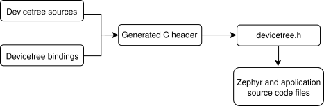
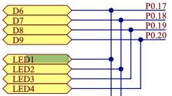

# Zephyr Device Driver Document

[Device Driver Model — Zephyr Project Documentation](https://docs.zephyrproject.org/latest/kernel/drivers/index.html)

모든 내용은 `nRF52dk(nRF52832 SoC)`를 기준으로 `sample/basic/blinky` 프로젝트로 분석을 한다.

# Devicetree

Devicetree는 Zephyr의 하드웨어 설명 언어이자 구성 언어

Zephyr는 아래와 같은 용도로 디바이스트리를 사용한다

1. 지원되는 보드에서 사용 가능한 하드웨어
2. 해당 하드웨어의 초기 설정

아래는 프로세스를 단순화한 디바이스 트리 빌드 흐름이다



> 💡 Zephyr RTOS는 Linux Foundation이 지원하며 Linux Kernel의 Devicetree를 차용

> 💡 하지만 Zephyr는 resource constrained system을 타겟으로 하기 때문에 디바이스 트리 정보를 binary(dtb 파일)로 메모리에 적재하여 런타임에 구문 분석하지 않는다.
>
> Zephyr는 configuration Phase에서 precompile header 파일(dts정보가 define 되어 있음) 생성후 Kconfig옵션에 따라 쓰이게 된다.

## Devicetree reflect hardware

실제로 디바이스트리 노드는 일반적으로 어떤 하드웨어와 대응하며, 노드 계층 구조는 하드웨어의 물리적 배치를 반영합니다. 예를 들어, SoC에 연결된 I2C 버스 컨트롤러에 연결된 세 개의 I2C 주변장치가 있는 보드를 고려해 보겠습니다


I2C 버스 컨트롤러와 각 I2C 주변장치에 해당하는 노드는 디바이스트리에 포함됩니다. 하드웨어 레이아웃을 반영하면 I2C 주변장치 노드는 버스 컨트롤러 노드의 하위 노드가 됩니다. 다른 유형의 하드웨어를 나타내는 데 유사한 관례가 있습니다.

DTS는 다음과 같이 보일 것입니다:

```text
/dts-v1/;

/ {
        soc {
                i2c-bus-controller {
                        i2c-peripheral-1 {
                        };
                        i2c-peripheral-2 {
                        };
                        i2c-peripheral-3 {
                        };
                };
        };
};
```

## nRF52DK Devicetree(nrf52dk_nrf52832.dts) LED

Basic Sample인 Blinky가 사용하는 Device인 led0의 dts를 살펴보자.

`boards/arm/nrf52dk_nrf52832/nrf52dk_nrf52832.dts`

```text lineNumbers=true {6}
/* Node in a DTS file */
leds {
		compatible = "gpio-leds";
		led0: led_0 {
			// led0가 gpio0.17에 연결되어 있으며 Active low로 동작한다고 유추된다.
			gpios = <&gpio0 17 GPIO_ACTIVE_LOW>;
			label = "Green LED 0";
		};
};
```

실제 하드웨어 Schematic을 살펴보면 P0.17 LED1(led0)가 연결되어 있다.



디바이스트리에 대한 더 많은 정보는 [Devicetree Guide](https://docs.zephyrproject.org/latest/build/dts/index.html#dt-guide)를 참조하세요.

# Devicetree Binding

Devicetree 자체는 상대적으로 구조화되지 않은 형식이므로 하드웨어 설명의 절반에 불과합니다. *Devicetree Binding은* 나머지 절반을 제공합니다.

[Configuration Phase](https://docs.zephyrproject.org/latest/build/cmake/index.html#build-configuration-phase) 동안 빌드 시스템은 Devicetree의 각 노드를 Binding 파일과 일치시키려고 합니다. 이것이 성공하면 빌드 시스템은 노드의 내용을 검증하고 노드에 대한 매크로를 생성할 때 바인딩 파일의 정보를 사용합니다.

## simple example

example devicetree node:

```text
/* Node in a DTS file */
bar-device {
     compatible = "foo-company,bar-device";
     num-foos = <3>;
};
```

Here is a minimal binding file which matches the node:

```yaml
# A YAML binding matching the node

compatible: 'foo-company,bar-device'

properties:
  num-foos:
    type: int
    required: true
```

빌드 시스템은 dts와 binding의 연결을 위해 compatible을 사용해 검사한다.

## What the build system does with bindings

빌드 시스템은 Binding을 사용하여 Devicetree node의 유효성을 검사하고 디바이스트리 내용을 생성된 devicetree_generated.h 헤더 파일로 변환합니다.

예를 들어, 빌드 시스템은 위의 바인딩을 사용하여 bar-device 노드에 num-foos 속성이 있는지 확인하고(required: true 이므로), 그 값인 <3>이 올바른 유형인지 확인합니다.

빌드 시스템은 그런 다음 bar-device 노드의 num-foos 속성에 대한 매크로를 생성하며, 이 매크로는 정수 리터럴 3으로 확장됩니다. Devicetree 매크로를 사용하면 C 코드에서 API를 사용하여 속성의 값을 가져올 수 있으며, 이에 대한 자세한 내용은 이 가이드의 이후에서 C/C++ 에서 Device tree Access Example 부분에서 다룬다.

## Blinky Example

역시 blinky예제로 binding 구조를 살펴본다.

Devicetree에서 본 `nrf52dk_nrf52832.dts` Devicetree 파일에서 사용된 led0를 살펴보자

`zephyr/boards/arm/nrf52dk_nrf52832`

```c
leds {
		compatible = "gpio-leds";
		led0: led_0 {
			// led0가 gpio0.17에 연결되어 있으며 Active low로 동작한다고 유추된다.
			gpios = <&gpio0 17 GPIO_ACTIVE_LOW>;
			label = "Green LED 0";
		};
};
```

`zephyr/dts/bindings/led/gpio-leds.yaml`

```c
compatible: "gpio-leds"

child-binding:
  description: GPIO LED child node
  properties:
    gpios:
      type: phandle-array
      required: true
    label:
      type: string
      description: |
        Human readable string describing the LED. It can be used by an
        application to identify this LED or to retrieve its number/index
        (i.e. child node number) on the parent device.
```

💡 Binding파일은 compatible과 호환되는 이름으로 작성하도록 명명규칙이 존재한다.
예를들어 compatible = “vnp,device”인 경우 ‘,’은 ‘-’로 치환되어 “vnp-device.yaml”이 된다

Devicetree Binding의 더 많은 정보는[Devicetree bindings](https://docs.zephyrproject.org/latest/build/dts/bindings.html)를 참조하세요.

# Build System(CMake) Configuration Phases

Zephyr 빌드 프로세스는 구성 단계(CMake에 의해 구동)와 빌드 단계(Make 또는 Ninja에 의해 구동)의 두 가지 주요 단계로 나눌 수 있다. 전체 흐름도는 아래와 같다.


아래에서 'build/'로 시작하는 경로는 CMake 실행 시 생성하는 빌드 디렉토리를 나타냅니다.

Devicetree

- `*.dts` (_devicetree source_) 및 `*.dtsi` (_devicetree source include_) 파일은 대상 architecture, SoC, board, application directories(\*.overlay) 에서 수집됩니다.
- `*.dtsi` 파일은 `*.dts` 파일에서 C preprocessor를 통해 포함됩니다. C preprocessor는 또한 devicetree `*.overlay` 파일을 병합하고 `*.dts`, `*.dtsi` 및 `*.overlay` 파일의 매크로를 확장하는 데 사용됩니다. 결과물은 `build/zephyr/zephyr.dts.pre`에 배치됩니다.
- 사전 처리된 디바이스트리 소스는 [gen_defines.py](https://github.com/zephyrproject-rtos/zephyr/blob/main/scripts/dts/gen_defines.py)에 의해 분석되어 미리 처리 매크로가 포함된 `build/zephyr/include/generated/devicetree_generated.h` 헤더를 생성합니다.
- 소스 코드는 devicetree에서 생성된 전처리 매크로에 액세스하기 위해 [devicetree.h](https://github.com/zephyrproject-rtos/zephyr/blob/main/include/zephyr/devicetree.h) 헤더를 포함하여야 합니다. 이 헤더는 `devicetree_generated.h`를 포함합니다.
- `gen_defines.py`는 또한 최종 devicetree를 빌드 디렉토리의 `build/zephyr/zephyr.dts`에 작성합니다. 이 파일의 내용은 디버깅에 유용할 수 있습니다.
- device tree compiler `dtc`가 설치된 경우, 이 도구에서 생성된 추가 경고 및 오류를 잡기 위해 `build/zephyr/zephyr.dts`에서 `dtc`를 실행합니다. `dtc`의 출력물은 그 외에는 사용되지 않으며, `dtc`가 설치되지 않은 경우 이 단계는 건너뜁니다.

Build System에 대한 더 많은 정보는 [Build and Configuration Systems](https://docs.zephyrproject.org/latest/build/index.html)를 참조하세요.

# C/C++ 에서 Device tree Access Example

## Node identifiers

특정 장치 트리 노드에 대한 정보를 얻으려면 해당 노드 식별자가 필요합니다. 이것은 노드를 참조하는 단순한 C 매크로다.

Blinky를 기반으로 Devicetree Node정보를 어떻게 얻는지 분석해보자.

```c lineNumbers=true {4}
#include <zephyr/kernel.h>

/* The devicetree node identifier for the "led0" alias. */
#define LED0_NODE DT_ALIAS(led0)
```

여기서 Node identifier란 LED0_NODE를 말한다. DT_ALIAS 매크로를 추적해보자.

```c lineNumbers=true {6}
#define DT_ALIAS(alias) DT_CAT(DT_N_ALIAS_, alias)

#define DT_CAT(a1, a2) a1 ## a2

//result
#define LED0_NODE DT_N_ALIAS_led0
```

결국 led0의 Node Identifier는 DT_N_ALIAS_led0다. 이게 무슨 의미를 가질까?

앞서 살펴본 Build System의 Configuration Phase에 따르면 dts, binding정보는 취합되어 Device처리 매크로가 포함된 `build/zephyr/include/generated/devicetree_generated.h` 헤더를 생성한다고 되어 있다. 살펴보자.

```c lineNumbers=true {4,10}
/*
 * Devicetree node: /leds/led_0
 *
 * Node identifier: DT_N_S_leds_S_led_0
 *
 * (Descriptions have moved to the Devicetree Bindings Index
 * in the documentation.)
 */

#define DT_N_ALIAS_led0 DT_N_S_leds_S_led_0
```

## Devicetree Node Properties Access

Devicetree와 Binding의 정보를 취합하여 생성된 단순 매크로다. 이것을 Zephyr Application에서 어떻게 사용되는지 살펴보자.

```c lineNumbers=true {11}
#include <zephyr/kernel.h>
#include <zephyr/drivers/gpio.h>

/* The devicetree node identifier for the "led0" alias. */
#define LED0_NODE DT_ALIAS(led0)

/*
 * A build error on this line means your board is unsupported.
 * See the sample documentation for information on how to fix this.
 */
static const struct gpio_dt_spec led = GPIO_DT_SPEC_GET(LED0_NODE, gpios);
```

GPIO_DT_SPEC_GET 매크로를 통해 gpio_dt_spec 구조체를 가져온다. 이 구조체는 GPIO를 제어하기 위한 정보(port, pin)들이 포함되어 있다.

```c
struct gpio_dt_spec {
	/** GPIO device controlling the pin */
	const struct device *port;
	/** The pin's number on the device */
	gpio_pin_t pin;
	/** The pin's configuration flags as specified in devicetree */
	gpio_dt_flags_t dt_flags;
};
```

실제로 구조체 정보를 가져오는 GPIO_DT_SPEC_GET을 따라가보자.

`zephyr/include/zephyr/drivers/gpio.h`

```c lineNumbers=true {37-42}
#define GPIO_DT_SPEC_GET(node_id, prop) \
	GPIO_DT_SPEC_GET_BY_IDX(node_id, prop, 0)

/**
 * @brief @p gpio_dt_spec를 위한 정적 이니셜라이저
 *
 * 이 매크로는 디바이스트리 노드 식별자, GPIO를 지정하는 속성 및 인덱스를 제공하여
 * @p gpio_dt_spec 구조체에 대한 정적 이니셜라이저를 반환합니다.
 *
 * 예제 디바이스트리 조각:
 *
 *	n: node {
 *		foo-gpios = <&gpio0 1 GPIO_ACTIVE_LOW>,
 *			    <&gpio1 2 GPIO_ACTIVE_LOW>;
 *	}
 *
 * 예제 사용법:
 *
 *	const struct gpio_dt_spec spec = GPIO_DT_SPEC_GET_BY_IDX(DT_NODELABEL(n),
 *								 foo_gpios, 1);
 *	// 'spec'을 다음과 같이 초기화합니다:
 *	// {
 *	//         .port = DEVICE_DT_GET(DT_NODELABEL(gpio1)),
 *	//         .pin = 2,
 *	//         .dt_flags = GPIO_ACTIVE_LOW
 *	// }
 *
 * 'gpio' 필드는 여전히 준비 여부를 확인해야 합니다. 예를 들어 device_is_ready()를 사용합니다.
 * 이 매크로를 사용하는 경우 노드가 존재하고 지정된 속성을 가지며 해당 속성이 위에 표시된대로
 * GPIO 컨트롤러, 핀 번호 및 플래그를 지정하는 경우에만 올바르게 사용합니다.
 *
 * @param node_id 디바이스트리 노드 식별자
 * @param prop 소문자 및 언더스코어로 작성된 속성 이름
 * @param idx "prop"에 대한 논리적 인덱스
 * @return 속성을 위한 struct gpio_dt_spec의 정적 이니셜라이저
 */
#define GPIO_DT_SPEC_GET_BY_IDX(node_id, prop, idx)			       \
	{								       \
		.port = DEVICE_DT_GET(DT_GPIO_CTLR_BY_IDX(node_id, prop, idx)),\
		.pin = DT_GPIO_PIN_BY_IDX(node_id, prop, idx),		       \
		.dt_flags = DT_GPIO_FLAGS_BY_IDX(node_id, prop, idx),	       \
	}
```

구조체를 초기화하는 매크로가 결과적으로 precompile단계에서 수행된다.

실제로 결과물이 어떤지 precompile 결과물을 살펴보자.

💡 `west build -b nrf52dk_nrf52832 -- -DCONFIG_COMPILER_SAVE_TEMPS=y` 로 빌드하면 precompile 파일인 `main.c.i`를 볼 수 있다.

`build/CMakeFiles/app.dir/src/main.c.i`

```c
static const struct gpio_dt_spec led = { .port = (&__device_dts_ord_11), .pin = 17, .dt_flags = 1, };
```

const struct device \*port인 &**device_dts_ord_11는 추상화된 Device Generic API인데 이는 `build/zephyr/drivers/gpio/CMakeFiles/drivers**gpio.dir/gpio_nrfx.c.s` 파일에서 찾을수 있다.

```c
__device_dts_ord_11:
	.word	.LC0
	.word	gpio_nrfx_p0_cfg
	.word	gpio_nrfx_drv_api_funcs
	.word	__devstate_dts_ord_11
	.word	gpio_nrfx_p0_data
	.word	__devicehdl_dts_ord_11
	.weak	__devicehdl_dts_ord_11
	.section	.__device_handles_pass1,"a"
	.align	1
	.type	__devicehdl_dts_ord_11, %object
	.size	__devicehdl_dts_ord_11, 26
```

gpio_nrfx_drv_api_funcs 등이 있는것으로 보아 gpio device 제어를 실제 담당할 것으로 보인다.

💡 이 부분의 분석은 추후 Device Driver에서 다룬다

조금 더 들어가보자. GPIO_DT_SPEC_GET_BY_IDX의 pin정보를 가져오는 부분은 어떻게 하는 걸까? 매크로를 따라가본다.

```c lineNumbers=true {89}
// GPIO_DT_SPEC_GET(LED0_NODE, gpios)
// node_id = DT_N_S_leds_S_led_0, prop = gpios, idx = 0
.pin = DT_GPIO_PIN_BY_IDX(node_id, prop, idx),

/**
 * @brief 인덱스에서 GPIO 스펙의 핀 셀 값을 가져옵니다.
 *
 * 이 매크로는 "pin"이라는 셀 이름을 가진 GPIO 스펙에만 작동합니다.
 * 필요한 경우 노드의 바인딩을 참조하여 확인하십시오.
 *
 * 예제 디바이스트리 조각:
 *
 *     n: node {
 *             gpios = <&gpio1 10 GPIO_ACTIVE_LOW>,
 *                     <&gpio2 30 GPIO_ACTIVE_HIGH>;
 *     };
 *
 * 예제 사용법:
 *
 *     DT_GPIO_PIN_BY_IDX(DT_NODELABEL(n), gpios, 0) // 10
 *     DT_GPIO_PIN_BY_IDX(DT_NODELABEL(n), gpios, 1) // 30
 *
 * @param node_id 노드 식별자
 * @param gpio_pha 소문자 및 언더스코어로 작성된 "phandle-array" 타입의 GPIO 속성
 * @param idx "gpio_pha"의 논리적 인덱스
 * @return "idx" 인덱스의 핀 셀 값
 */
#define DT_GPIO_PIN_BY_IDX(node_id, gpio_pha, idx) \
	DT_PHA_BY_IDX(node_id, gpio_pha, idx, pin)

/**
 * @brief 인덱스에서 phandle-array 스펙의 셀 값을 가져옵니다.
 *
 * 아래의 인자 순서를 `node->phandle_array[index].cell`와 유사하게 읽으면 도움이 될 수 있습니다.
 * 즉, 셀 값은 @p pha 속성 내의 @p node_id에서, 인덱스 @p idx의 스펙 안에 있습니다.
 *
 * 예제 디바이스트리 조각:
 *
 * @code{.dts}
 * led0: led_0 {
 * 			gpios = <&gpio0 17 GPIO_ACTIVE_LOW>;
 * 			label = "Green LED 0";
 * };
 * led1: led_1 {
 * 			gpios = <&gpio0 18 GPIO_ACTIVE_LOW>;
 * 			label = "Green LED 1";
 * };
 * @endcode
 *
 * `gpio0` 및 `gpio1` 노드에 대한 바인딩 조각:
 *
 * @code{.yaml}
 *     gpio-cells:
 *       - pin
 *       - flags
 * @endcode
 *
 * 위 예제에서 `gpios`는 두 개의 요소가 있습니다:
 *
 * - 인덱스 0의 스펙은 <17 GPIO_ACTIVE_LOW>이므로 `pin`은 17이고 `flags`는 0x1입니다.
 * - 인덱스 1의 스펙은 <18 GPIO_ACTIVE_LOW>이므로 `pin`은 18이고 `flags`는 0x1입니다.
 *
 * 예제 사용법:
 *
 * @code{.c}
 *     #define LED DT_NODELABEL(led)
 *
 *     DT_PHA_BY_IDX(LED, gpios, 0, pin)   // 17
 *     DT_PHA_BY_IDX(LED, gpios, 1, flags) // 0x3
 * @endcode
 *
 * @param node_id 노드 식별자
 * @param pha "phandle-array" 타입의 소문자 및 언더스코어로 작성된 속성
 * @param idx @p pha의 논리적 인덱스
 * @param cell 스펙 내의 @p pha 인덱스 @p idx에 있는 소문자 및 언더스코어 셀 이름
 * @return 셀의 값
 */

// node_id = DT_N_S_leds_S_led_0
// pha = gpios
// idx = 0
// cell = pin
#define DT_PHA_BY_IDX(node_id, pha, idx, cell) \
	DT_CAT7(node_id, _P_, pha, _IDX_, idx, _VAL_, cell)

#define DT_CAT7(a1, a2, a3, a4, a5, a6, a7) \
	a1 ## a2 ## a3 ## a4 ## a5 ## a6 ## a7

// result : DT_N_S_leds_S_led_0_P_gpios_IDX_0__VAL_pin
```

결과적으로 `DT_GPIO_PIN_BY_IDX(node_id, prop, idx) == DT_N_S_leds_S_led_0_P_gpios_IDX_0__VAL_pin`로 나온다. precompile 결과물을 보면 이 값은 17로 치환된다. 그렇다면 역시 `devicetree_generated.h`에 정의가 되어 있을것이다.

```c
#define DT_N_S_leds_S_led_0_P_gpios_IDX_0_VAL_pin 17
```

# 정리

- Devicetree, Binding을 통해 Build System은 Configuration Phase에서 `devicetree_generated.h`파일을 생성한다.
- `devicetree_generated.h`는 각종 디바이스 정보가 Define되어 있으며 이는 `DT_` 로 시작되는 Zephyr 매크로를 통해 디바이스에 접근하고 제어한다.
- Device의 Node ID는 Prefix Define에 불과하므로 변수에 담을 수 없다
- 실제 노드의 Property들은 `devicetree_generated.h`에 Node*ID*\* 형태로 Define이 되어 있다.
- 이것에 접근하는 API 매크로는 Zephyr RTOS Document를 참조하세요
