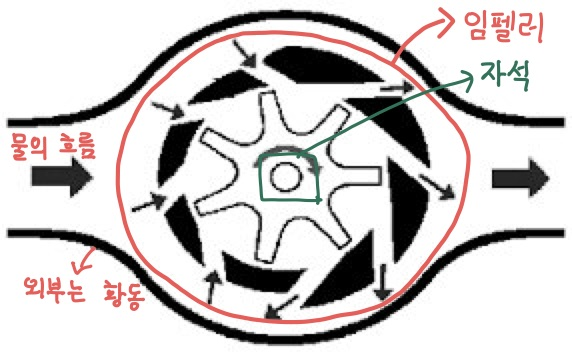

블로그를 2021초에 만들고 꾸준히 글을 쓰려 했으나 회사의 업무가 바쁘다는 핑계로
미뤄왔었다. 이제 퇴사를 하여 백수가 된 시점에서 미뤄왔던 일들을 취미삼아
하려한다 주제는 그때마다 내가 쓰고 싶은 글이므로 어떻게 될지는 모르겠다

첫번째 글은 신입사원 시절에 진행한 프로젝트 개발과 관련된 일기다.
수도미터 원격 검침 단말 및 시스템을 제조 및 서비스하는 회사에 입사하여
2018~2021년까지 일하며 기억에 남는 문제점들과 그 해결방법들을 되돌아보며 일기 형식으로 정리하려 한다
그때를 되새기며 기록하는 이 글이 스스로의 발전에 도움이 되기를 바란다😅

- [서론](#introduce)
  - [개발 배경](#Reason)
  - [그래서 초음파 수도미터가 임펠러보다 뭐가 좋은데❓](#WhyUltrasonic)
- [개발 시작과 문제 발생](#StartNProblem)

# 서론 

## 개발 배경

회사는 수도미터 계량기, 수도미터 검침 및 무선 단말, 검침 데이터를 보여주는
웹, 단말기 설정 스마트폰 앱,생산용 엡 등 수도미터 원격 검침에 필요한 시스템들을 개발하여 지자체에 납품하는
회사였다.

나는 수도미터 계량기의 Firmware를 개발하는 신입사원으로
입사하였다. 기존 회사의 수도미터 계량기 제품은 업계 용어로 임펠러 회전식 수도
계량기라 지칭하였는데 업계의 전자식 수도미터는 대부분(90% 이상) 임펠러식을 사용하였다.
지자체에 납품하여 매출을 올리는데 가격이 중요한 경쟁요소였고 임펠러식은 가장
저렴한 전자식 수도 계량기였기 때문이다.

회사는 KTC(한국기계전기전자시험연구원)의 차세대 수도미터 개발 협업 요청으로
국책사업으로 초음파 수도미터를 막 시작하려던 참이었고 수도미터 계량기
담당자로 입사한 나는 해당 프로젝트를 입사와 동시에 시작하였다.

### 임펠러 수도미터의 이해

초음파 수도미터에 대한 이해에 앞서 기존 임펠러 수도미터를 들여다 볼 필요가
있다. 차세대 기술의 필요성은 기존의 기술에서 발생하는 단점, 불편함을
개선하거나 장점을 더욱 증진시켜
고객 경험의 향상을 이끌어내지 못하면 빛 좋은 개살구가 되기 때문이다.

입사 후 임펠러식에 대한 이해와 실제 코드를 파악을 하는것 부터
시작했다 임펠러식 수도미터는 아래 그림과 같이 구성된 유량부, 그 위에 결합되는 전자부가
있다. 유량부는 물이 흐르면 임펠러부가 회전하게 되며 그 회전을 전자부는 자석의
회전으로 발생하는 자기장을 감지하는 센서를 통해 자식의 회전을 감지하며 회전 속도에 따라 유량을 추측식으로 얼마나 흘렀는지 계산을
하게 된다. 여기서 추측식이라고 한 이유는 회전속도를 기반으로 산출한 유량은 실제 유량과 같지 않기때문이다

**임펠러 수도미터의 단점**

- 임펠러 회전부의 마찰로 인해 압력의 손실이 발생
- 임펠러의 구동력이 필요하므로 저속의 물의 흐름은 감지를 못할 수 있다
- 임펠러부의 여러개의 좁은 입구들은 작은 돌맹이같은 이물질이 들어와 끼게
  되면 회전하지 못하는 부동의 문제가 발생
- 임펠러부가 물의 흐름이 빨라지거나 이물질의 영향으로 마모가 되어 추측식
  유량의 오차율이 커질 수 있음
- 물의 흐름이 좁은 입구로 들어와 넓은 곳으로 퍼지고 다시 좁은곳으로 나가는
  방식으로 되어 있어 완전 발달 유동이 아니므로
  유량 추측 오차율이 개별마다 커짐.
  (_자세한 설명은 초음파부에서_ 😄)

입사 2~3주 정도가 지나고 임펠러 수도미터의 파악이 위와 같이 될 무렵 초음파 수도미터
개발은 확정되었다.

### 초음파 수도미터 개발 시작

총 개발 일정은 1년이지만 인증 일정을 빼면 6개월이 실 개발 일정이었다. 프로젝트의 인원 구성은 펌웨어 2명(관리자, 실무자), 하드웨어 2명(관리자, 실무자) 한달간 펌웨어, 하드웨어 실무자가 사전조사 및 개발방향에
대해 매주 발표일정이 잡혔고 발표한 내용을 기반으로 토론하여 칩, 부품 선정을
진행했다. 한달간의 사전조사로 초음파식의 장점은 위에서 기술된 임펠러의
단점들을 개선할 수 있을것으로 보였으나 가격이 상대적으로 비싼 부분이 압도적인
단점이었다 😢

수도미터 업계(라 하고 대부분의 임베디드 제품)는 가격이 가장
중요한 요소임을 부정할 수 없다 특히나 지자체 납품이 100%인 회사의 고객은
공무원으로 극단적으로는 저가 경쟁 입찰이 잦아 제품의 개발이 완료되어도 제품이 잘 팔릴
수 있을지 의문이지만 국책사업의 지원비로 진행되므로 개발비가
사실상 들지 않고 회사 제품의 다각화 및 기술력 홍보의 일환으로 프로젝트는
진행되었다.

## 그래서 초음파 수도미터가 임펠러보다 뭐가 좋은데❓

### 초음파 수도미터의 기본 원리

초음파 수도미터는 두개의 압전 센서가 유량부에 설치된다

> 압전 센서(Piezo Sensor)는 전기적 신호를 진동으로 변환하여 초음파를
> 발생시키거나 역으로 진동을 전기적 신호로 변환시켜주는 센서 따라서 송, 수신이
> 둘다 가능하다

압전센서에서 발생된 초음파는 유체(물)을 통과하며 그림과 같이 T1, T2
두개의 경로로 송수신 한다 초음파의 특성은 물리학에서 말하기를 파동이며 종파라 한다
종파는 매질의 진동 방향과 파동의 진행 방향이 서로 평행한 파동을 말한다

> 여기서 T1, T2는 해당 경로로 송신 후 수신되는 시간이다 TOF(Time Of
> Flight)라고도 한다.

매질의 진동 방향과 파동이 진행 방향이 같은게 어떤 의미인가? 파동의 속도가
매질의 속도에 영향을 받는다는 것이다. 유량부의 물이 흐를경우 T1은 V만큼
빨라질 것이며 T2는 V만큼 느려진다. 따라서 유속 V는 T1-T2의 시간으로 유추가 가능하다
이것이 초음파 수도미터의 기본이 되는 원리이다

> 횡파는 매질의 진동 방향과 파동의 진행 방향이 서로 수직인 파동 ex) 빛, 전파
>
> 그 유명한 상대성 원리는 횡파의 성질을 가지는 빛의 특성으로 인해 아인슈타인의
> 과감하고 놀라운 통찰력으로 밝혀진다😲

## 칩, 유량부 선정

한달간의 사전 조사 및 발표로 초음파 수도미터로 사용할 수 있는 칩들은
공통적으로 기본 원리가 위와 같았다. 회사는 Texas Instrument의 저전력 칩들을
대부분의 제품에서 사용하고 있었기 때문에 추가적인 칩의 공부가 필요없는
TI제품라인을 사용하기로 결정했고, 해당 칩을 사용하면 기능들을 라이브러리로
제공해주기 때문에 어려울 것이 없어 보였다.

유량부는 구매하여 사용하기로 결정되었고 가격문제로 저가의 Made in
China 제품으로 결정 제품의 최종 모양새는 아래와 같아졌다.

##### Figure [TI 초음파 유량계]

### Texas Instrument Ultrasonic sensing solution

칩은 MSP430FR6047이라는 이름의 초음파 수도미터 전용 칩이며 TI에서는 관련
라이브러리로 USS(Ultrasonic Software Library)를 제공한다 그 구성도는 아래와
같은데 간단하게 말하면 TI왈 필요한 기능들 Library형태로 다 만들어 놨으니까
API만 사용하면 된다라고 주장하는 것인데 글을 작성하는 지금은 최신 버전의 그림을 가져와서 Calibration 기능이 포함되어 있는데 2018년 당시 개발할 때는 Calibration 기능이 존재하지 않았다.

저 문제가 후에 작성할 내용의 주된 내용이며 이글을 작성하는 이유다.......😥

# 개발 시작과 문제 발생

MSP430FR6047 칩과 유량부를 받고 USS Library를 사용하여 유량을 구하는 코드를
짧은 시간에 작성하고 호기롭게 유량측정 테스트를 하러 갔다. 테스트 장비는
그림과 같이 생겼는데 FlowMeter를 시험대에 걸어 물을 흘리고 Meter의 유량값과
초록색 물통의 실제 유량을 비교하는 방식으로 진행된다

테스트를 해보니 그 정밀하다는 초음파 FlowMeter의 유량값은 TestBench의 값과 맞지 않았다
코드를 다시 점검해도 Library의 사용법부터 유량 계산은 틀리진 않았고 무언가 예상치 못한
문제가 있음을 직감하게 되었다.

# 작성중
