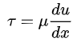
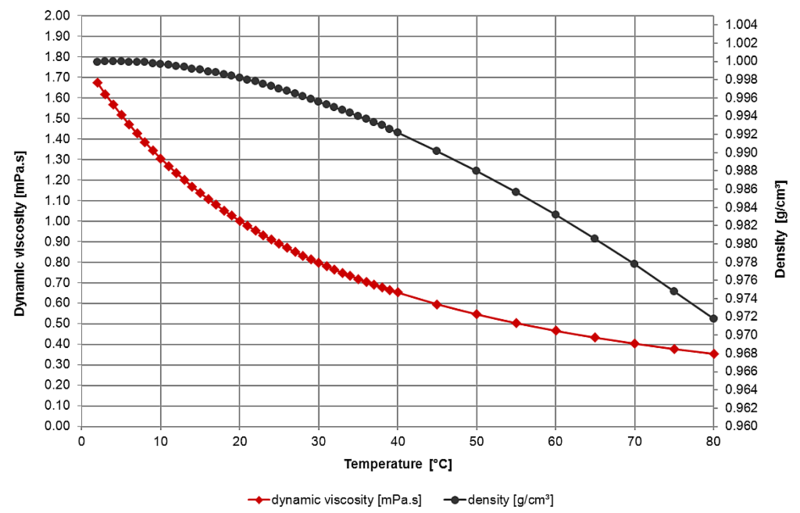

프론트엔드 공부 차원에서 블로그를 2020년에 만들고 꾸준히 글을 쓰려 했으나 내가 관리하는 제품군이 늘어나며 회사 업무가 많아져
미뤄왔었다. 다양한 독서와 공부를 하고 싶다는 생각이 들어 퇴사를 하고 백수가 된 시점에서 남는 시간에 취미삼아
포스팅 하려한다. 이번 포스팅은 신입사원 시절(2018~2019)에 진행한 초음파 수도미터 개발과 관련된 회고이자 복기다.

수도미터 원격 검침 단말 및 시스템을 제조 및 서비스하는 회사에 입사한 첫해에 진행한 초음파 수도미터 개발, 특허출원 과정의 내용과 기억에 남는 문제점, 해결법들을 뒤돌아보며 당시에 내가 결정한 것이 합리적이었는지 곰곰이 생각해보며 글을 쓴다

#### 특허 정보

<a href="https://doi.org/10.8080/1020190101926">초음파 수도 계량기의 유량 측정 방법과 그 초음파 수도계량기
THE METHOD OF FLOW MEASUREMENT FOR SONIC FLOW METER, THE SONIC FLOW METER</a>

# 서론

## 개발 배경

회사는 전자식 수도미터 계량기, 수도미터 검침 및 무선(NB-IoT, LoRa) 단말, 검침 데이터를 보여주는
웹, 서버, 단말기 설정 스마트폰 앱,생산용 PC 앱등 수도미터 원격 검침에 필요한 시스템들을 개발하여 지자체에 납품하는 작은 규모의
회사였다. 나는 Firmware를 개발하는 신입사원으로 입사하였다.

회사의 기존 전자식 수도미터 계량기 제품은 업계 용어로 임펠러식 혹은 터빈식이라 지칭하였는데 물이 흐르면 내부의 바퀴가 회전하는 방식이다. 업계의 전자식 수도미터는 대부분(90% 이상) 임펠러식을 사용하였다.
지자체에 납품하여 매출을 올리는데 가격, 보증기간(8년)이 중요한 경쟁요소였고 임펠러식은 가장
저렴하고 오랜기간 검증된 전자식 수도 계량기였기 때문이다.

회사는 KTC(한국기계전기전자시험연구원)의 차세대 수도미터 개발 협업 요청으로
초음파 수도미터 개발을 막 시작하려던 참이었고 나는 해당 프로젝트를 입사한지 얼마 안돼 시작하였다.

### 임펠러 수도미터의 이해

초음파 수도미터에 대한 이해에 앞서 기존 임펠러 수도미터를 들여다 볼 필요가
있다. 차세대 기술, 신제품은 기존의 기술에서 발생하는 단점, 불편함을
개선, 장점 증대, 새로운 경험의 창출을 이끌어내지 못하면 빛 좋은 개살구가 되기 때문이다.

입사 후 임펠러식에 대한 구조적 이해와 실제 코드를 파악을 하는것 부터
시작했다. 임펠러 수도미터의 레거시 코드는 10000라인 미만의 작은 코드였고 컨셉이 단순해 파악이 쉬웠다. 임펠러식 수도미터는 그림과 같이 구성된 유량부, 그 위에 결합되는 전자부가
있다. 유량부는 물이 흐르면 임펠러부가 회전하게 되며 전자부는 임펠러 중앙에
있는 자석의 회전으로 발생하는 자기장을 센서로 감지하여 회전속도를 알아내고 회전 속도에 따라 유량을 추측식으로 얼마나 흘렀는지 계산을 하게 된다. 여기서 추측식이라고 한 이유는 회전속도를 기반으로 산출한 유량은 마찰, 물의 압력 등 여러가지 요소들로 실제 유량과 같지 않기때문이다

**임펠러 수도미터의 단점**

- 임펠러 회전부와 물의 추가적 마찰로 인해 압력의 손실이 발생
- 임펠러의 구동력이 필요하므로 저속의 물의 흐름은 감지를 못할 수 있다.
- 임펠러부의 여러개의 좁은 입구들은 작은 돌맹이같은 이물질이 들어와 끼게
  되면 회전하지 못하는 부동의 문제가 발생
- 임펠러부가 물의 마찰, 이물질의 영향으로 마모가 되고 특성이 변해 추측식
  유량의 오차율이 커질 수 있음
- 외부에 강한 자석을 부착하면 회전을 강제로 멈출 수 있고 불법적인 계량값
  조작이 가능하다.
- 입구가 좁은 형태에서 임펠러쪽은 넓어지는 형태로 유체가 완전 발달유동이
  아니라 저속 유량에서 오차율의 변동이 크게 생긴다.

입사 2~3주 정도가 지나고 임펠러 수도미터의 파악이 위와 같이 될 무렵 초음파 수도미터
개발은 확정되었다.

<!-- > 추측식으로 발생하는 오차율의 변동성은 생산팀, 고객과의 주된 갈등 요소였다 -->
<!-- > 이 부분에 대해 전자부의 신뢰성을 의심하였으나 대부분 문제는 완전 발당 유동이 아니며 -->
<!-- > 조립 불량, 임펠러 회전부 불량 등으로 발생하는것으로 나는 추측했었고 분석 및 실험적으로는 증명을 했으나 이론적 증명을 명쾌하게 하지 못했다. 그래서 설명하고 이해시키고 예방하는것이 어려웠다. 아쉬움이 많이 남는다. -->

### 초음파 수도미터 개발 시작

총 개발 일정은 1년이지만 인증 일정을 빼면 1년이 안되는 일정이었다. 프로젝트의 인원 구성은 펌웨어 2명(관리자, 실무자), 하드웨어 2명(관리자, 실무자) 한달간 펌웨어, 하드웨어 실무자가 사전조사 및 개발방향에
대해 매주 발표일정이 잡혔고 발표한 내용을 기반으로 토론하여 칩, 부품 선정을
진행했다. 한달간의 사전조사로 초음파식의 장점은 위에서 기술된 임펠러의
단점들을 개선할 수 있을것으로 보였으나 유량부의 가격이 상대적으로 비싼 부분이 압도적인
단점이었다. 😢

수도미터 업계(라 하고 대부분의 임베디드 제품)는 가격이 가장
중요한 요소임을 부정할 수 없다. 제품의 개발이 완료되어도 제품이 잘 팔릴
수 있을지 의문이었지만 연구비 지원으로 개발비가
사실상 들지 않고 회사 제품의 다각화 및 기술력 홍보의 일환으로 프로젝트는
진행되었다.

## 그래서 초음파 수도미터가 임펠러보다 뭐가 좋은데❓

초음파는 사람의 가청이 불가능한 20㎑ 이상의 음향적 진동을 초음파라 한다. 초음파는 빛이나 전파와 같은 파동 에너지이지만 전파 속도가 늦고, 반사하기 쉬운 특성이 있다.

### 초음파 수도미터의 기본 원리

초음파 수도미터는 두개의 압전 센서가 유량부에 설치된다

> 압전 센서(Piezo Sensor)는 전기적 신호를 진동으로 변환하여 초음파를
> 발생시키거나 역으로 진동을 전기적 신호로 변환시켜주는 센서 따라서 음파의 송, 수신이
> 둘다 가능하다

압전센서에서 발생된 초음파는 유체(물)을 통과하며 그림과 같이 T1, T2
두개의 경로로 송수신 한다 초음파의 특성은 물리학에서 말하기를 파동이며 종파라 한다
종파는 매질의 진동 방향과 파동의 진행 방향이 서로 평행한 파동을 말한다

> 여기서 T1, T2는 해당 경로로 초음파 송신 후 수신되는 시간이다 TOF(Time Of
> Flight)라고도 한다.

매질의 진동 방향과 파동이 진행 방향이 같은게 어떤 의미인가? 파동의 속도가
매질의 속도에 영향을 받는다는 것이다. 첨부 그림의 유량부의 물이 흐를경우 T1은 V만큼
빨라질 것이며 T2는 V만큼 느려진다.

위의 원리를 초음파 수도미터에서 적용하는 Equation 도출은 아래와 같다.

초음파 수도미터 칩을 제공하는 회사의 주장은 tAB, tBA를 정밀하게 측정을
해준다는 것이고 사용자 환경에 따른 d, L값의 변수만 입력하면 정확한 유량을
구할수 있다는 것이다

### 칩, 유량부 선정

한달간의 사전 조사 및 발표로 초음파 수도미터로 사용할 수 있는 칩들은
공통적으로 기본 원리가 위와 같았다. 회사는 Texas Instrument의 저전력 칩들을
대부분의 제품에서 사용하고 있었고 때마침 TI에서 초음파 수도미터 칩을 Release하여 추가적인 칩의 공부 시간이 절약되는
TI제품라인을 사용하기로 결정했고, 해당 칩을 사용하면 기능들을 라이브러리로
제공해주기 때문에 어려울 것이 없어 보였다.

> arm, atmega만 써봤지만 근본적 구조는 비슷하니 어려운 점은 없었다.
> 오히려 arm에 비해 쉬운 칩이었다

> 나중에 개발도중 생각지도 못한 문제점들이 나오면서
> 폭포수 모델의 개발방법론의 단점을 체감했다. 애자일한 개발을 하자.

유량부는 구매하여 사용하기로 결정되었고 가격문제로 저가의 Made in
China 제품으로 결정 제품의 최종 모양새는 아래와 같아졌다.

##### Figure [TI 초음파 유량계]

#### Texas Instrument Ultrasonic sensing solution

칩과 임베디드 개발에 대한 이해는 Chip DataSheet로 시작해서
Chip DataSheet로 끝나지만 글이 너무 길어지며 글의 목적에서 벗어나는 듯 하여
해당 부분은 생략하고 넘어간다

칩은 MSP430FR6047이라는 이름의 초음파 수도미터 전용 칩이며 TI에서는 관련
라이브러리로 USS(Ultrasonic Software Library)를 제공한다 그 구성도는 아래와
같은데 간단하게 말하면 TI 가라사대 필요한 기능들 Library형태로 다 만들어 놨으니까
필요한 API만 사용하면 된다라고 주장하는 문서인데 글을 작성하는 지금은 최신 버전의 그림을 가져와서 Calibration 기능이 포함되어 있는데 당시 개발할 때는 Calibration 기능이 존재하지 않았다.

저 문제가 후에 작성할 내용의 주된 내용이며 이글을 작성하는 이유다.......😥

> 라이브러리에 Calibration기능이 추가된 이후에 비교 검토 결과 TI기능은 양산, 출하과정 이점이 떨어져 이 글의 방법을 유지했다.

# 본론

## 개발 시작

### 유량 산출 알고리즘

MSP430FR6047 칩과 유량부를 받고 USS Library를 사용하여 유량을 구하는 코드를
작성했다 해당 라이브러리의 Parameter의 이해와 User 설정값을 찾아내는 과정은 생략하고 공식 가이드 링크로 대체한다. 공식 Guide문서를
읽으면 충분하기 때문이다.
<a href="https://software-dl.ti.com/msp430/msp430_public_sw/mcu/msp430/USSSWLib/USSSWLibWater/latest/">USS Library Guide</a>

유량을 구하는 알고리즘을 간략화 하면다음 1~5번을 주기적으로 반복 하는
것이었다.

1. 압전 센서를 이용해 TOF1, TOF2를 구한다
2. DTOF = TOF1 - TOF2를 구한다
3. 산출된 DTOF를 USS Library에 파라메터로 넘긴다.
4. USS Library는 유속(V)를 Return한다.
5. 자사의 유량부 면적(A) \* 유속(V) \* 측정 시간 주기 = 체적 유량(VolumeFlow)이다

### 문제 발생

호기롭게 유량측정 테스트를 하러 갔다 테스트 장비는 그림과 같이 생겼는데 FlowMeter를 시험대에 걸어 물을 흘리고 Meter의 유량값과
초록색 물통의 실제 유량을 비교하는 방식으로 진행된다

테스트를 해보니 그 정밀하다는 초음파 FlowMeter의 유량값과 TestBench의 오차율이 컸다.
코드를 다시 점검해도 Library의 사용법부터 유량 계산 알고리즘의 기본 전제는 틀리진 않았고 무언가 예상치 못한
문제가 있다고 생각했다.

## 문제의 원인을 찾자❗

고민을 했지만 문제의 원인을 알 수 없었고 내가 파악하지 못한 변수가 유량값에 영향을 끼친다고 결론을 내렸다.
당시에 AI, Deep Learning, 통계학의 주요 컨셉을 흥미로 가볍게 보고 있었는데 지금 문제를 해결하기 좋은 방식이라는 생각이 들었고 모방하기로 결정했다.

모방하기로 한 방식은 라벨링된 데이터(정답지)로 입력변수와 결과의 상관계수를 찾아내는
법이다. 현재 라벨링된 데이터는 TestBench의 유량 결과로 가정하고, 입력변수는 TestBench의 유속 설정, 물의 온도, 실험한 총 유량의 값...기타 등등으로 가정하여 확보할 수 있는 최대한 많은 입력 변수를 전부 기록하기로 했고 시험 FlowMeter의 개수도 최대한으로 늘려 일주일정도를 실험만 돌려 데이터를 확보했다. 실험중 나온 데이터는 Python을 통해 분류 및 저장을 편하게 할까 잠시 고민했지만 배보다 배꼽이 큰거같아 수동으로 엑셀로 정리하였다.

데이터를 엑셀의 분석도구를 활용해 오차율이 높아지는 상관계수는 물의 온도,
시험대의 유속 두가지 변수가 높다는걸 알게되었다. 이 문제가 유체와 관련된 문제임을 알게되었고
명확한 원인 파악을 위해 내 업무시간은 코딩이 아니라 유체역학을 공부하는 것이
되었다

### 유체역학 학습으로 추론한 문제의 원인

#### USS 평균유속 문제점

유체역학 이론에 따르면 실제 파이프에는 마찰로 인해 층류(Laminal) 및 난류(Turbulent)형태로 흐른다 따라서 기존 유량 산출 알고리즘은 USS Library로 파이프 중앙의 유속을 측정하고 Firctionless Flow로 가정하여 평균 유속을 구하므로 층/난류 정도에 따라 평균유속의 오차가 발생한다.

> 여기서 마찰은 파이프 벽면과 물의 마찰 뿐만 아니라 같은 물분자 끼리도 마찰의 성질이 작용한다. 난류의 정확한 해석은 여전히 미제(謎題)라고도 한다.

**Frictionless flow**: 모든 영역에서 동일한 속도로 흐르는 유체
(이상적 유체이며 내가 상상한 물의 흐름이었다) 
**Laminar flow**: 유체 속도가 벽 근처(마찰이 더 많은 곳)에서 가장 느리고 중앙(마찰이 적은 곳)에서 가장 빠름. 점성이 높고 유체의 속도가 느릴때 보이는 흐름. 
**Turbulent flow**: 유체가 모든 방향으로 질서없이 흐르는 상황을 나타냅니다. 이것은 벽의 덜 매끄러울때, 점성이 낮고 유체의 속도가 빠를때 보이는 흐름.

#### 층/난류의 정도를 결정 짓는 변수

그렇다면 이 문제를 해결하기 위해선 층류와 난류가 발생하는 이유 및 정도를 입력변수들로 예측할
수 있어야 하는것으로 귀결된다 그것또한 위대한 과학자 뉴턴, 레이놀즈가 실마리를 친절하게
알려주신다.

### 뉴턴 유체(Velocity Profile의 선형성)

#### 유체의 정의

물질 내의 응력이 그 물질의 변형률의 시간변화율의 함수로 나타내어지는 물질 
외부에서 전단응력(shear stress)이 작용하면 그 힘이 아무리 작더라도 연속적으로 변형하는 것.

- 전단응력(단위 τ)

면적 / 단면적에 평행 한 힘

> 두꺼운 책을 놓고 책 표지에 손바닥을 댄 다음 옆으로 민다고 생각해보자. 이때 책의 옆면은 직사각형에서 평행사변형 형태로 변형될 것이다. 이것이 바로 전단응력과 전단응력에 의한 변형이다. 파이프 내의 물의 흐름과 유사하다.

#### 수도미터 유체 특성

초음파 수도미터는 액체상태의 물의 특성만을 가정한다. 물은 아래와 같은 특성을 지닌다.

**비압축성 유체** :
압력에 따른 밀도 변화가 무시할수 있을만큼 작다 
**점성 유체** :
유체의 흐름을 방해하는 저항 성질이 존재 
**연속체** :
유체내에서 연속적으로 변하는 유체의 성질. 성질변화가 대단히 완만하여 그 물
질을 해석하는데 미분학을 사용할 수 있다는 것을 의미 
**등방성** :
특성이 모든 방향을 따라 동일함. 

> 실제로 모든 유체는 점성이 있고 압축성이기 때문에 이상유체를 가정할 수 없지만,
> 점성과 압축성의 효과가 매우 작은 유체의 경우는 일반적으로 이상유체로 가정한다.

#### 전단응력과 점성 그리고 유체속도

전단응력이 가해지면 유체는 연속적으로 변화하므로, 그림에서 보듯이, 전단응력 τ가 한 평면에
작용할 때, 위 표면은 아래 표면 보다 𝛿u만큼 큰 속력으로 움직이며, 전단변형각 𝛿θ은 시간에 따라 계속적으로 커질 것이다. 이때 뉴턴 유체의 경우 작용된 전단과 그
로 인해 발생하는 변형률 사이에 선형비례관계가 정의된다.

이때 비례상수가 점성계수이며 차원의 동차성에 의해 점성계수는 응력-시간의 차원을 갖으며 단
위는 N sec/m2 이다

- 이렇게 전단응력과 유체의 속도사이에 **선형관계**(**예측가능**)를 만족하는 유체를 Newtonian 혹은 Newton Fluid라 한다.
- 유체역학에서는 일반적으로 변형각보다는 속도분포(Velocity profile)에 관심이 있다

수학적 방적식으로는 아래와 같다.

τ : 전단응력
u : 점성계수
du/dx : 전단 변형률

위와같이 뉴턴 유체의 특성으로 인해 초음파 수도미터에서 측정한 평균 유속(Frictionless 평균 유속)은 실제 전단 응력, 점도에 따른 실제 평균 유속(속도분포[Velocity profile])이 다름을 알수있다.

그리고 물은 뉴턴 유체의 성질로 인해 이상적 유체(Frictionless Flow)와 실제 유체(층,난류)의 오차율은 점성, 𝛿u(속도, 입출구의 압력차) 두가지 변수에 **선형적**이라 추측할 수 있다.

> 기존 초음파 수도미터들의 특허를 찾아본 결과 이러한 이유로 다회선식 초음파 센서로
> 정밀하게 측정하는 방식들을 제시한다. 회선이 늘어날 수록 정밀한 Velocity profile 측정이 가능할 것으로 보이나
> 비용의 증가로 해당 방식을 적용할순 없었다.

### 레이놀즈 수(Reynolds Number)

"관성에 의한 힘"과 "점성에 의한 힘(viscous force)"의 비로서, 주어진 유동 조건에서 이 두 종류의 힘의 상대적인 역학관계를 정량적으로 나타낸다.

레이놀즈 수는 유체 동역학에서 가장 중요한 무차원 수 중 하나이며, 다른 무차원 수들과 함께 사용되어 동적 상사성(dynamic similitude)을 판별하는 기준이 된다. 두 유동 패턴이 기하학적으로 상사일 때, 이 두 유동의 주요 무차원 수들이 동일한 값을 가지면, 이 두 유동이 동적 상사성을 가졌다고 말하며 이 두 유동은 그 형태가 유사하게 된다.

이 동적 상사성의 특징은 두가지의 합리적인 가설을 제공해준다.

1. 초음파 수도미터의 속도 분포의 뉴턴 유체의 특성으로 변수는 점도(점성), 전단응력의 세기(관성)이다. 또한 레이놀즈 수의 상사성의 원리를 이용하여 점성, 관성이 다를지라도 레이놀즈 수가 같다면 같은 Velocity Profile로 나올것으로 생각할 수 있다.
2. 다양한 초음파 수도미터는 면적, 모양이 같아(엄밀히 말하면 미세한 차이이므로
   무시해도 좋은) 동적 상사성 관계를 만족하므로 동일한 보정 알고리즘이 적용가능.

또한 레이놀즈 수는 또한 유동이 층류인지 난류인지를 예측하는 데에도 사용된다.
하지만 초음파 수도미터 오차 보정에 필요한 것은 Velocity Profile뿐이므로 층류
난류의 구분은 무시하고 동적 상사성만 주목한다.

여기에서 vs는 유체의 평균 속도, L은 특성 길이(characteristic length), u 는 유체의 점성 계수(Dynamic Viscosity), v 는 유체의 동점성 계수(Kinematic Viscosity), p는 유체의 밀도이다.

앞서 살펴본 물의 비압축성으로 나는 유체의 밀도는 무시했다.

> 기존 Reynolds Number Equation의 vs는 유체의 평균속도(결국 Velocity
> Profile)이지만 나는 점성과 관성력의 비율만 관심이 있으므로 유체의 평균속도가
> 아닌 유체 중심의 속도로 대체했다.

### vs(유체의 중심 속도) u(점성계수) 구하기

위에서 살펴본 이론들을 배경으로 뉴턴 유체의 특성으로 발생되는 선형적인 오차 변화를 예측하는게 알고리즘에 적용되어야 한다. 즉 Velocity Profile Factor의 변수는 Reynolds Number(점도, 유체 중심의 속도)이니 두개 변수를 알면 오차 보정이 가능할 것으로 보인다.

- 기존 알고리즘 결과는 유체의 중심 속도[𝛿u]를 제공.

물의 점도는 현재 알고 있는 변수가 아니다. 하지만 물의 온도는 다음과 같은 과정으로
구할 수 있다.

#### 물의 온도 구하기

USS Library는 TOF(Time of Flight)를 제공한다.

- 비행거리는 일정하다 (상수)
- TOF는 매번 측정되는 변수

TimeofFlight = (tAB + tBA) / 2

따라서 온도는 비행속도로 구할수가 있다. C(초음파 속도)와 수온의 관계는 아래의 그래프와 같다.

하지만 위의 방정식은 무려 5차 방정식이었고 1차 전지를 사용하는 수도미터에서
고차원 방정식을 매번 연산하기는 배터리 소모가 크므로 Lookup Table 방식으로
온도를 구하는 방식을 선택했다.

#### 물의 점도

온도에 따른 물의 점도는 이미 측정된 데이터로 알려져 있다.

물은 비압축성 유체이기 때문에 온도가 물의 점도를 결정하는 유일한 요소다
점도 역시 Lookup Table로 구한다.

## 해치웠나❓ 어림 없지❗

위의 문제점만 적용해도 1급 수도미터 기준의 오차율을 만족하는 것을 확인해 초기 프로젝트의 목표는 이미 달성했고, 바로 제품의 판매가 이뤄지지 않는점에서 끝내도 되는
상황이었지만 시간적 여유가 있어 개인적인 욕심을 더 냈다.

### 제품의 양산, 출하를 생각하면 문제가 되는 점

1. 수도미터 유량계는 생산시 Q3,Q2(+-2%), Q1(+-5%)의 오차율을 만족해야 하고 인증시 0.33Q3, 0.7Q3등을 더 시험 보는데 10개 수도미터의 시험데이터를 기반으로 이것을
   모두 만족하는 구간별 Factor를 찾는 방정식을 만들어본 결과 5차가 넘는 고차방정식이었고 연산량이 커 배터리 소모가 컸다.

> Q1,Q2,Q3는 각각 최소유량,전이유량,최대유량이라 하는데 수도미터가 작동할
> 수 있는 범위내에서 특별히 오차율 시험을 보는 구간이라 보면 된다

> 수도미터는 1차전지로 무려 8년의 보증기간을 요구한다

2. 개별 수도미터에는 고차 방정식을 적용하면 오차율을 만족하지만 여러개의 수도미터의 시험 구간별 오차율 그래프(M1~M10)는 미묘하게 달랐고 모두를 공통으로 만족시키는 하나의 방정식은 찾지 못했다(다항식 회귀 곡선, 최소 자승법 등등)

3. 제품의 초음파 측정주기가 짧을수록 정확하지만 배터리 소모는 컸다.

따라서 더 낮은 연산량의 방정식과 개별 수도미터의 오차율이 허용오차를
만족하는 방식, 측정주기 개선이 필요했다.

#### 양산, 출하를 고려한 수정 사항들

1. 개별의 수도미터 오차는 생산시 1회성으로 TestBench로 Q3,Q2,Q1을 시험하고 오차율 보정을 한다.
2. 나머지 구간은 보정은 스플라인 보간법[Spline Interpolation(Piecewise Polynomial
   Interpolation)]을 적용하여 연산량을 낮추기로 결정했다

따라서 아래와 같게 된다

3. 측정 주기는 그림과 같이 개선하여 T(주기)를 늘려도 오차율이 동일하거나 좋게
   나오도록 했다.

> v1, v2 값의 차이에 따라 T를 가변적으로 하는것도 적용했으면 좋았을 텐데
> 그 기능을 고민할때쯤 특허 준비로 정신 없었다 😥

### 변경된 알고리즘

유속 보정 알고리즘은 다음과 같이 변경 되었고 제품 인증과 특허출원으로 마무리
되었다.

1. 압전 센서를 이용해 TOF1, TOF2를 구한다
2. DTOF = TOF1 - TOF2를 구한다
3. 산출된 DTOF를 USS Library에 파라메터로 넘긴다.
4. USS Library는 중심 유속(V)를 Return한다.
5. 자사의 유량부 면적(A) \* 유속(V) = 체적 유량(Frictionless VolumeFlow)이다
6. TOF에서 물의 온도 계산하기
7. 온도 및 USS Return 유속(V)으로 현재 Reynolds Number 구하기
8. RE값의 범위에 따라 f1또는 f2의 Spline 보간식이 적용된다
9. Spline 보간식의 y값 (Frictionless 유량 : 실제 유량의 비율(Factor)이 나온다)
10. 실제 유량 = Frictionless \* Factor

# 결론

제품은 필드에 실제 설치되어 테스트를 진행했고, 몇개 지자체에 시범적으로 설치되어 운영되었다.
아마 내가 퇴사하고 1년 이내 제품 판매, 영업이 적극적으로 할 것으로 보인다.

1년 남짓 초음파 수도미터 개발을 진행하면서 위와같이 문제들을 해결하고
결과적으로는 인증, 특허 등이 문제없이 마무리 되었다. 그 이후로 다른 제품
업무를 하면서 유지보수에는 신경을 많이 못쓴 제품이었다.

퇴사를 하면서 후임자에게 인수인계를 해주면서 드는 생각은 아쉬운 점들이 많은
제품이다

- 회사의 공식적인 코딩 컨벤션, 문서화 룰이 없어 내 나름대로 룰을 세우고 작성하고 룰을
  따르려 했지만 돌아보니 미흡하다. (clangFormat, DoxyGen 사용)
- 임펠러도 양산시 Q3,Q2,Q1 시험을 하여 2차 보정을 하지만 초음파 수도미터는
  생산성 향상을 위해 양산시 시험 과정을 없애고 싶었으나 결국 못했다.
  이론적으로는 가능할 것으로 보여서 더욱 아쉽다.

그래도 진행하면서 뒤돌아보면 괜찮았던 점들도 있다.

- 기존 임펠러식의 서술된 단점들은 모두 확실하게 개선했다
- 위의 문제해결 과정을 문서화하고 프로젝트 인원들에게 공유하거나 후임자에게
  인수인계를 해주는 경험은 오히려 내가 명확하게 이해하는데 도움이 되었다
- 프로그래밍 이외의 물리학, 통계학의 지식들이 쓰여 문제를 해결하는 것은 재미있는 경험이었다.
- 다른 국내 초음파 수도미터들의 성능, 가격 상대적 비교가 우월했으며 수도미터
  성능이 뛰어난 독일산 제품과 비교할만 했다.

다 작성하고 보니 글을 쓴다는게 참으로 많은 생각이 든다. 쓰고 지우기를 반복하며 우여곡절 끝에 하나의 포스팅을 완성했지만 아쉬운 부분이 계속해서 보이니 참으로 신기하다. 수도미터에 대한 전반지식이 없는 사람도 이해할수 있는 글을 쓴다는 생각으로
작성을 했는데 전문가가 보면 속빈 강정이고 일반인이 보면 이해가 안가는 애매한 글이 되었나 라는 생각도 든다. 내 이야기를 써서 인터넷에 올리는 것도 여전히 쑥쓰럽다. 글을 쓰는 다양한 이유들이 있겠지만 나는 스스로를 위해 쓴다. 다른 사람에게 설명을 하다보면 내가 알고있다고 생각했던것도 어설픈 지식임을 깨닫게 된다. 내 생각을 표현하는 연습과 지식의 재점검이 주 목적이다.
